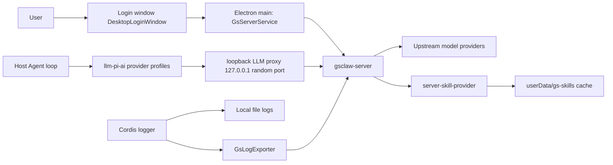

# gs-worker Server Integration

## Overview

The desktop product in this repository ships as **gs-worker**, an office Agent: `dsh-plugin-desktop` packages with `productName: gs-worker` and `appId: com.enterprise.officeagent`, the brand mark comes from `build/brand/logo.png` and `build/brand/gszq.png`, and the Web UI brand slots are filled by the Desktop-owned occupant (`src/client/desktop-brand.tsx`) while `cordis.patch.yml` disables the upstream `ui-brand-official`. The product depends on the external **gsclaw-server** (a separate repository): sign-in, models, skills, and client logs all flow through it.

All three core lanes land in the Host-owned client layer inside the Electron main process (`dsh-plugin-desktop/src/server/`); the renderer never holds a server token:



Client-layer responsibilities: `gs-endpoint.ts` resolves and validates the server endpoint; `gs-auth.ts` is the session state machine; `gs-client.ts` is the low-level HTTP client with the 401 refresh retry; `gs-config.ts` caches the server-pushed ClientConfig; `gs-brand.ts` resolves the brand (push / cache / default); `gs-contract.ts` defines every wire shape; `gs-server-service.ts` composes them into the Cordis `gsServer` service; `gs-server-route.ts` exposes the Host-private same-origin routes; `gs-llm-proxy.ts` and `gs-llm-models.ts` implement the model lane; `gs-log-exporter.ts` implements log upload.

## Sign-in and session lifecycle

The startup gate lives in `src/main.ts`: before the Host boots, a pre-boot `GsServerService` is loaded and `restoreSession()` runs; when restore fails (no refresh token, a revoked token, or a transport failure) the `DesktopLoginWindow` opens (`src/login-window.ts` + `src/native-ui/login/`), and only the user choosing Quit aborts the launch. A successful login flows straight into the same `GsServerService` instance the Host generation later uses.

Token discipline is concentrated in `src/server/gs-auth.ts`:

- **The access token lives only in process memory** and dies with the process; the renderer sees only `signed-in`/`signed-out` plus the user projection through `GsSessionView`, never a token.
- **The refresh token is a rotating, single-use credential**, sealed with Electron safeStorage into `userData/gs-refresh-token.bin` (0600, directory 0700); every refresh persists the rotated successor before the new session is considered live. When safeStorage is unavailable, login is refused (`GsAuthStorageError`), because a refresh token is never persisted in plaintext.
- **All refreshes funnel through one single-flight promise**: the server treats a concurrent refresh as token replay and revokes the whole family, so `refreshTokens()` shares one in-flight promise. A 401/403 refresh answer means the family is gone: local credential state is wiped and `onSessionLost('expired' | 'disabled')` fires.
- A legacy server that issues no rotating token pair degrades to a memory-only session ending with the process.
- A transport failure keeps the persisted refresh token: the login window still opens and renders its offline state, and the next launch retries.

Neither the login window nor the settings account page (`src/client/DesktopSettingsSection.tsx`, which shows the current user and endpoint and offers sign-out) talks to the server directly; both use the Host-private same-origin routes `/api/gs-server/*` (`src/server/gs-server-route.ts`), so credential state never leaves the main process.

## Endpoint contract

gsclaw-server endpoints the client consumes (wire shapes in `src/server/gs-contract.ts`):

| Endpoint | Purpose |
| --- | --- |
| `GET /api/v1/meta` | Public handshake; returns `serviceName`, `loginMethods`, `minimumClientVersion`, the `llmProxy` flag, and an optional `brand` |
| `GET /api/auth/methods` | Login-method switches (password / WeCom / email) |
| `GET /api/auth/captcha` | One-time graphical captcha; a 404 means the server predates captchas |
| `POST /api/auth/login` | Password login (optionally with captcha), returning the token pair, user, and ClientConfig |
| `POST /api/auth/email/send-code` | Send an email verification code |
| `POST /api/auth/email/verify` | Email-code login; the success shape matches password login |
| `POST /api/v1/auth/refresh` | Rotate the refresh token, returning the new pair and the latest ClientConfig |
| `POST /api/v1/auth/logout` | Revoke the session family server-side (best effort, local cleanup first) |
| `GET /api/client-config` | Actively pull the effective ClientConfig |
| `GET /api/skills` | Server skill catalog (enabled skills only; legacy lane, excludes server-mcp) |
| `GET /api/skills/:name/files` | Skill bundle files (base64) for cache materialization |
| `POST /api/skills/report-installed` | Fire-and-forget installed-set report (locally materialized client skills only) |
| `GET /api/v1/skills/catalog` | All-type skill catalog (name/version/runtimeType/definitionRevision, server-prefiltered) |
| `GET /api/v1/skills/:name/definition` | Remote skill SKILL.md body and parameter definitions (queries / allowlisted MCP tool schemas) |
| `POST /api/v1/skills/:name/execute` | Server-side execution of a data-query template or server-mcp tool (echoes definitionRevision) |
| `POST /api/v1/llm/:providerId/v1/chat/completions` | Model gateway, reached through the loopback proxy |
| `POST /api/logs/client` | Client runtime log batch upload |

Host-private same-origin routes for the renderer (under `/api/gs-server/`): `meta`, `captcha`, `login`, `email-code`, `email-login`, `logout`, `session`, `skills`, `brand`.

Companion additions in the gsclaw-server repository: the LLM gateway route above (which also writes `model_request_logs` and `chat_logs`), `POST /api/logs/client` backed by the `client_logs` table, the admin-side `GET /api/admin/logs/client`, and the `llmProxy: true` flag on `GET /api/v1/meta`.

Error conventions (`src/server/gs-client.ts`): legacy `/api/*` routes answer `{ error, message }`, `/api/v1/*` routes answer `{ code, message, traceId }`, and 429 adds `Retry-After`; both envelopes normalize into `GatewayError`. `authorizedJson` injects the in-memory access token and, on a `token_expired`/`token_invalid`/`unauthorized` 401, runs one single-flight refresh and retries the request exactly once.

## Model lane

The Agent loop never talks to a model provider directly. `src/server/gs-llm-proxy.ts` runs an HTTP proxy on a random `127.0.0.1` port:

- Each boot generation mints a 32-byte base64url placeholder token; the proxy accepts loopback connections only, accepts only `POST /v1/{providerId}/chat/completions`, and requires `Authorization: Bearer` to carry that placeholder token (constant-time comparison).
- On forwarding, the placeholder is swapped for the in-memory gsclaw-server access token and the request goes to `{endpoint}/api/v1/llm/{providerId}/v1/chat/completions`; SSE and JSON answers stream through without buffering, and a client disconnect aborts the upstream read.
- An upstream 401 buys one single-flight refresh and exactly one retry; a second 401 passes through untouched.

`src/server/gs-llm-models.ts` turns the server ClientConfig `models` section into executable configuration: `planGsLlmModelProfile` generates one `llm-pi-ai` provider profile per server provider (`api: openai-completions`, `baseURL` pointing at the proxy's `/v1/{providerId}`) and resolves `defaultPrimary` into the `agent-default-model` selection; `mirrorGsLlmModelSettings` owns the settings document's `llm-pi-ai:`, `llm-deepseek:` (removed), and `agent-default-model:` sections outright, and a push that changes nothing never triggers a rewrite. The settings file is hot-reloaded, so a mirrored update reaches the running adapter without a restart.

No key touches disk: the settings document carries only the credential reference `apiKeyEnv: DSH_DESKTOP_LLM_PROXY_TOKEN`; the placeholder token itself lives solely in the launch-environment memory snapshot (`gsLlmProxyLaunchEnvironment`) — never written to disk and never materialized into `process.env`, so sandboxed tool subprocesses cannot inherit it, while `ctx.credentials` and the pi-ai adapter's launch-environment fallback both resolve it.

Composition adds two more gates: `cordis.patch.yml` disables `llm-deepseek` (the direct adapter would bypass the proxy) and `ui-settings-models` (the Models page would hold provider keys on the client); `filterLlmPatches` in `src/profile.ts` strips every mention of these identities from user and home patch layers, and `assertEffectiveLlmRows` asserts after composition that no disabled row revived and that the `llm-pi-ai` / `agent-default-model` rows keep their canonical package identities. Even a server-pushed `features.customModel: true` only logs — apiKeys never leave the server, so custom model settings stay disabled.

### Vision model (local MCP bridge and Vision Router)

The server-side vision model (currently `gs-cloud/qwen36-35b`) is not pushed into the ClientConfig model list: the server deliberately keeps it out of the user-selectable list (gsclaw-server `scripts/fix-models-vision.ts`) and holds it only as the `models.visionModel` reference; the server gateway's `llmProxy.resolveProxyTarget` separately allows that reference even though it is absent from the user-selectable whitelist. Desktop agents reach it through two lanes, both riding the loopback proxy with no token touching disk; both are MCP/tool lanes, not skill discovery, so the local-skill ban is unaffected.

**Lane one: local MCP bridge (path-based).** After Host bootstrap, `src/main.ts` mounts the upstream `@deepseek-ai/dsh-mcp-client` programmatically (stdio transport), launches `lib/mcp-vision-server.js` (`src/mcp-vision-server.ts`) under `ELECTRON_RUN_AS_NODE`, and registers the `mcp__vision__analyze_image` tool. The tool reads a local image (PNG/JPEG/WebP/GIF sniffed by magic bytes; raw file ≤ 2.5 MB — after base64 inflation the body must stay under both the loopback proxy's 4 MiB cap and the server express 4mb cap), calls the vision model as a multimodal chat completion through the loopback proxy at `POST /v1/gs-cloud/chat/completions`, and returns the text analysis. The per-boot proxy token reaches only this child via the mcp-client `config.env` carve-out — it still never enters `process.env` or disk.

**Lane two: dsh-vision-router (paste-based).** The community plugin ships as a desktop dependency mounted by the `vision-router` row in `cordis.patch.yml` (the row id matches the plugin's own bundle patch, so a manual `dsh plugin add` collapses instead of double-mounting). The desktop patch skips onboarding and setup guides and renders no Vision switch. Once the model directory is ready, it automatically selects the chat model's `gs-cloud-vision` wrapper, preserving the model and reasoning effort; later model choices are rebound and restored image sessions stay enabled. Users paste or upload images directly and the plugin's fourteen `vision_*` tools handle multi-step work (describe/ground/crop/OCR). The vision backend is not static config: `mirrorGsLlmModelSettings` rewrites the `vision-router:` settings namespace's `httpProviders` with the per-boot loopback origin on every launch (`apiKeyEnv: DSH_DESKTOP_LLM_PROXY_TOKEN`, resolved through `ctx.credentials` → the launch-environment snapshot); the namespace is desktop-managed, so manual edits in the settings card are overwritten on the next boot. Shipped gates: `freeFallback: false`, `downscaleMaxPixels: 2000000`, `maxImageBodyBytes: 2800000`, `deepseekTakeover: false`, and `updateCheck: false`. The last four are hardened by `patches/dsh-vision-router@2.1.3.patch`: the three switches are captured from the row config into module-scope `productGates` at `apply` time — the execution layer trusts only the row config, so the settings card cannot re-enable them at runtime (with the fallback gated, the built-in OVH chain is force-dropped inside `httpProvidersOf`/`orderedHttpProviders`; ungated, the takeover would rebuild a direct `deepseek-official` route around the banned `llm-deepseek` row). `maxImageBodyBytes` is a patch-added request-body byte budget enforced at the single `callOpenAICompatible` egress on the total inline-image bytes of each request (descending JPEG quality ladder, then dimension halving, fail-closed with `VISION_IMAGE_PREPROCESS_FAILED`) — it catches small-but-dense PNGs the pixel budget never triggers (e.g. 1100×1100 at 4.8 MB), keeping bodies inside both 4 MB proxy caps. Its dependency potrace is GPL-2.0: internal distribution only, registered in `THIRD_PARTY_NOTICES.md` under the same posture as the AGPL office plugin.

## Skill lane

Local skill discovery is banned in the desktop product; skills arrive from the server alone. The ban is enforced by three gates:

1. **Patch disable**: the `skill-filesystem` row carries `disabled: true` in `cordis.patch.yml` (the launcher-owned desktop layer — the first gate).
2. **Profile stripping and assertion**: `filterLocalSkillPatches` in `src/profile.ts` removes every insert/override/enable of that identity from each non-desktop patch layer; `assertEffectiveSkillRows` then asserts the composed graph holds no enabled `skill-filesystem` row and refuses to boot otherwise.
3. **Preset sanitization**: `materializeDesktopPresetRoot` copies the shipped preset root into a profile-private directory, skipping every preset's `skills/` directory and rewriting its composition file with `stripLocalSkillCompositionRows`; the agent-presets row composes with `includeShippedRoot: false` and `includeUserRoot: false`, so user-authored preset roots no longer enter the roster.

`tool-skill` (the model-facing skill catalog and loader, consuming only the `ctx.skills` registry) is not banned: presets mount it per agent so the server-delivered catalog reaches each agent; `assertEffectiveSkillRows` also pins it to its canonical package `@deepseek-ai/dsh-tool-skill`, refusing to boot if any surviving row was swapped for a same-named impostor.

Server skills come from `src/server-skill-provider.ts`: it registers into the Host's `ctx.skills` registry at rank `BUNDLED_SKILL_RANK + 100` (i.e. 700), so no residual local source can win a duplicate name. The catalog comes from `GET /api/skills`, then filtered subtractively by the ClientConfig `skills` switches: the reserved master key `SKILLs` (mixed case, not a valid skill name, so it never collides with a real skill) set to `off` disables the whole skill feature and empties the catalog; per skill, only an explicit `off` removes it from the catalog, while `on` or an unlisted skill follows the delivered catalog (`/api/skills` already only carries enabled, authorization-filtered skills) — the switch table is not a whitelist. Bundles materialize from `GET /api/skills/:name/files` into `<userData>/gs-skills/<name>@<version>` — the files response gets a raised 42 MiB gateway byte cap (base64 inflates ~4/3 over the 30 MiB bundle ceiling; every other endpoint keeps the default 1 MiB), and strict base64 validation is a linear scan rather than a regex (multi-MiB payloads overflow the regex engine stack); paths must be relative and free of `.`/`..` segments, each file ≤ 8 MiB, the bundle ≤ 30 MiB and ≤ 500 files, and a bundle without `SKILL.md` is refused. Writes stage beside the target, mark `.complete` last, and rename into place, so a crash never leaves a loadable partial directory; superseded versions are removed once the new one lands. With no session or an unreachable server the catalog is empty and Host startup is never blocked. After each catalog change, one deduplicated best-effort report goes to `POST /api/skills/report-installed`.

The provider also maintains a synchronization snapshot (the `gsSkillSync` tracker): the status, success timestamp, and lite skill list of the latest catalog sync, plus `masterOff` (whether the master switch is off) and `switchedOff` (how many delivered skills a per-skill `off` suppressed), keeping the last good snapshot and writing one `warn` log line when a fetch fails. The settings page's Skills section (`src/client/DesktopSkillsSection.tsx`) shows this server-delivered skill list and the last sync time, read through the private same-origin route `GET /api/gs-server/skills`, so the renderer never touches a token here either. Empty states are distinguished by priority: `masterOff` shows "The server has disabled the skill feature"; an empty catalog with suppressed skills shows the count ("N skills have been switched off by server controls"); otherwise "The server has not delivered any skills yet"; and a non-empty catalog with suppressed skills appends one hint line with the count.

### Server skill execution (data-query / server-mcp)

A skill's `runtimeType` selects its execution lane. Every catalog sync first probes the capability handshake `GET /api/v1/meta`: with the `skillExecution` capability the provider uses the new protocol `GET /api/v1/skills/catalog` (all three runtime types, prefiltered by the server for enabled + authorization + ClientConfig); a legacy server without the field falls back to `/api/skills`, remote types stay invisible, and behavior matches the old build.

- `client`: unchanged bundle materialization lane, badged "Desktop" in settings.
- `data-query` / `server-mcp`: **no bundle is materialized**. The provider registers a virtual skill whose `SkillDefinition` content comes from `GET /api/v1/skills/:name/definition` (the SKILL.md body, frontmatter already stripped server-side) with no resourceBase; metadata carries `execution: 'server'` plus runtimeType and definitionRevision. The provider also renders the definition's `mcp.tools` / `dataQuery.queries` allowlist (names, descriptions, parameter schemas) as Markdown appended to the content — capped at 16 KB and truncated beyond that — so the `/skill-name` gesture and the `skill` tool both inject the exact tool names and argument shapes, and the model never has to guess them. Definition caching is in-memory only, isolated by endpoint + signed-in user + skill name + definitionRevision; sign-out or an account switch clears it, and late responses arriving during a session change are discarded so a previous account's content never enters the new session. Remote types stay out of `report-installed` (no local-install semantics; the report shape is unchanged, and because the v1 catalog carries no id field, client skills report their name as the id).
- Unrecognized or non-advertised types never become candidates and never degrade to local execution; they only show as unavailable in settings (the copy distinguishes "execution type not supported" from "definition sync failed").

The model bridge is the desktop-owned Host-plane plugin `src/server-skill-tools.ts` (the `server-skill-tools` row in cordis.patch.yml, canonical identity `dsh-plugin-desktop/server-skill-tools`, pinned by `assertEffectiveSkillRows` the same way): it registers the `run_data_query` / `run_mcp_skill` tools (the same names skill SKILL.md instructions cite) and forwards to `POST /api/v1/skills/:name/execute` through `src/server/gs-skill-execution.ts`. The tools run in the Electron main process and register into the root `ctx.tools` layer (visible to every agent, subject to the existing approval policies) — never a sandbox tool subprocess — because the access token lives only in main-process memory; renderer and model see arguments and results only. Visibility follows the `gsServerSkillCatalog` share the provider publishes: a tool registers only while the handshake advertises the matching type AND the effective catalog holds an available skill of that type, and unregisters/re-registers as the catalog changes; a same-name conflict logs a warning instead of crashing. A skill name in the arguments must belong to the current effective catalog of the matching type (the server re-checks authorization independently on every execution). Execution discipline: only an authentication-stage 401 gets the single-flight refresh with exactly one retry; timeouts (default 120 s client-side ceiling), disconnects, 5xx, and 429 are never replayed; results keep traceId and truncated, and server failures return to the model as errors, never as empty-data success. A `definition_changed` failure invalidates the catalog and returns "the definition changed; reload the skill and reconstruct the call" as the tool error — no blind replay.

## Log lane

Logs travel three independent paths:

1. **Model request logs**: the gsclaw-server LLM gateway writes `model_request_logs` and `chat_logs` server-side; the loopback proxy only streams and records no request content on the client.
2. **Client log upload**: `src/server/gs-log-exporter.ts` is a Cordis exporter coexisting with the local `FileExporter`; it buffers rendered, `mask-secrets`-masked messages and posts batches to `POST /api/logs/client` (flush at 50 records or every 10 seconds; at most 200 records and 192 KB per batch; a 2000-record queue drops the oldest on overflow). Uploads are strictly best-effort: a failed batch is discarded without retry, and shutdown grants one final flush a two-second grace; uploader diagnostics go straight to the local file sink so they never recurse through `ctx.logger`. The server stores them in the `client_logs` table, surfaced to admins through `GET /api/admin/logs/client`.
3. **Local file logs are unchanged**: `userData/logs/dsh-YYYY-MM-DD.log` (plus `.error.log`) still rotates at 10 MiB, keeps seven days, and stays under 200 MiB, with `dsh-desktop.logLevel` controlling verbosity.

## Application update delivery

The ClientConfig `appUpdate` field (`GsAppUpdateConfig`, `src/server/gs-contract.ts`) is pushed by the server inside login, refresh, and `GET /api/client-config` responses, carrying one new-version notice: `version` (a plain dotted-number version), optional `notes` (one line per release note), `downloads` (per-platform direct installer links: `windowsX64` / `macArm` / `macIntel`), optional `availableFrom` (when downloads open), and an optional `downloadWindow` (automatic-download hours). `null` or absent means no update prompt.

The client consumption lane: the `desktop-server-updates` plugin (`dsh-plugin-desktop/src/server-updates.ts`, mounted in `cordis.patch.yml`, `inject = ['desktopRuntime', 'gsServer']`) subscribes to the `ctx.gsServer.config` push snapshots and additionally pulls `/api/client-config` every 5 minutes (`pullIntervalMs`) — the first pull runs 15 seconds after boot (`initialPullDelayMs`) so a `restoreSession()` push can arrive first; pull failures (signed-out or offline) stay completely silent. Every snapshot passes through `src/server-app-update.ts`: `parseServerAppUpdate` defensively parses the wire JSON (the version must be canonical numeric SemVer, links must be credential-free http(s), and notes/availableFrom/downloadWindow are shape-checked; any malformed field voids the whole notice — never prompt, never crash), then `evaluateServerAppUpdate` decides:

- no `appUpdate`, a version not newer than the installed one, or no download for the current platform/arch → no action;
- `now < availableFrom` → notify-only: the dialog has no download button and only states when downloads open;
- otherwise a native dialog shows (title plus the notes as body lines, with an "Upgrade" primary button), and choosing "Upgrade" runs the whole upgrade automatically; "Later" suppresses repeat prompts for that version within the same run (in-memory dedup; the next launch prompts again).

Download and install discipline: the installer is GET'd from the `downloads` direct link — no login required, no `X-DSH-*` headers, no echoed-header validation (the gsclaw-server static directory does not echo them); writing reuses the community channel's defenses: the 1 GiB size cap, PE/DMG magic validation, and temporary-file plus rename atomic completion (`downloadDesktopUpdateFromUrl`, `src/update-download.ts`). After the "Upgrade" confirmation there is no further interaction: no save dialog, and the installer always lands in the managed `updates/` directory below userData (a 0700 private directory, `desktopUpdateManagedDirectory`; the filename defaults to the link's basename, falling back to the generated `gs-worker-<version>-<platform>.<ext>` on unsafe characters or a mismatched extension), with a system notification when the download starts. On completion, Windows skips the "Restart and Install" confirmation: the installer is launched in NSIS `/S` silent mode and the app exits (keeping `--updated --force-run`, so the installer relaunches the upgraded app); macOS cannot install a DMG silently, so the DMG opens automatically with an instructions dialog for a manual drag-install. Download failures (network/validation/cancellation) never open a dialog — they log and post a failure notification. Server-channel artifacts are recorded with a `managed: true` flag (`recordDesktopUpdateArtifact`); on the first launch after the upgrade, `performUpdateArtifactCleanup` deletes the leftover installer silently, while community-channel artifacts downloaded to a user-chosen path carry no flag and still ask "Delete Installer?" as before. `downloadWindow` gets no automatic downloads: the only download trigger in this client is the one "Upgrade" click, and the server contract exempts manual downloads from the window, so the field is only shape-validated and never evaluated. When the adapter is not injected (`serverUpdates` missing) or the build cannot download (`canDownload === false`), one log line is written instead of a prompt; a signed-out (cleared) snapshot never acts.

### Operational requirements for publishing a new version

A complete release runs the following steps in order; each step carries one verifiable hard requirement:

1. **Version number**: bump `version` in `dsh-plugin-desktop/package.json` and update every assertion that pins it — the application-identity assertion in `tests/package.spec.ts`, the three `productVersion` / `appVersion` / `currentVersion` expectations in `tests/electron-runtime.spec.ts`, and the version references in both README translations together with the blob hashes in `README.i18n.yaml`. Commit the version bump separately from feature changes.
2. **Packaging**: `corepack yarn dist:win` (the Windows-safe gate runs first and must be fully green). electron-builder downloads Electron and NSIS components from GitHub; on a restricted network, prefix the command with `ELECTRON_MIRROR=https://npmmirror.com/mirrors/electron/` and `ELECTRON_BUILDER_BINARIES_MIRROR=https://npmmirror.com/mirrors/electron-builder-binaries/`. The artifact is `dsh-plugin-desktop/dist/gs-worker-<version>-x64-Setup.exe`; record its local sha256. Local builds are not Authenticode-signed (signing is a separate manual release step; unsigned packages trigger a SmartScreen "Unknown publisher" warning).
3. **Hosting**: the installer must sit behind a credential-free http(s) direct link that answers GET with 200 and supports Range. The current production convention is the CorAliyun (8.138.102.170) nginx 443 site's `/downloads/` prefix (`location ^~ /downloads/` aliased to `/opt/gs-downloads/`, read-only, non-GET/HEAD methods denied, `Content-Disposition: attachment` set; pre-change site config backups live at `/etc/nginx/litellm.bak-*` on the server). Upload through the same site's `PUT /upload/<filename>` with Basic authentication, as described below; the server-side sha256 must match the local one. The alternative is gsclaw-server's own `PUT /api/admin/releases/packages/:platform/:filename` (files land in the server-side `downloads/` directory and serve as `/gsworker/downloads/<filename>`), but that deployment's fronting nginx rejects large installers with 413 until `client_max_body_size` is raised to 2048m and nginx is reloaded.
4. **Registration**: `POST <endpoint>/api/admin/releases/publish` with `Authorization: Bearer <RELEASE_API_TOKEN>` (configured in the server `.env`, preferred) or an admin-account JWT (`POST /api/auth/login`, which requires solving the graphical captcha first). The body is `{"appUpdate": {...}}` with these field rules: `version` accepts only plain dotted-number SemVer (no prerelease/build) and must be **strictly newer** than the installed client version to trigger a prompt (equal or older versions are inert); `downloads` needs at least one platform with a complete direct link; before `availableFrom` the client only notifies without offering the download; `downloadWindow` is not consumed by this client and may be omitted. The publish endpoint writes only after full validation — a failed upload or publish never changes the currently registered release.
5. **Verification**: `GET <endpoint>/api/admin/releases/current` echoes the registration; `curl -I` on the download link returns 200 with `Accept-Ranges: bytes`; a signed-in client must show the upgrade prompt within 5 minutes (scheduled pull) or on the next restart/sign-in.
6. **Testing tip**: to trigger the prompt without a newer package, temporarily register a higher version whose link points at the same installer, then restore the registration to the real version afterwards. Beware the residue: while the registered version is newer than the installed binary, the managed artifact in userData `updates/` never satisfies the "installed version ≥ artifact version" cleanup condition, so it lingers and the prompt repeats — after the test, delete that directory's contents and restore the registration.

Two hard constraints: **appUpdate only covers the stable channel** — a beta `-beta.N` version does not satisfy the server field's plain-number requirement, so beta clients still get their update prompts from the community channel (`update-checker.ts`); **the registered version must equal the installer's real version** — a permanently inflated registration keeps managed artifacts forever uncleaned and re-prompts on every launch.

### CorAliyun HTTPS installer uploads

WebDAV PUT was enabled on the existing nginx 443 site on 2026-09-09, with no additional port. The account is `gs-upload`; upload credentials are stored in `upload.netrc` at the project root. The original copy remains in `%USERPROFILE%\.config\gs-worker\upload.netrc` on the operator's machine (that copy has a Windows ACL restricted to the current user and SYSTEM). Upload from PowerShell at the project root:

```powershell
curl.exe --noproxy 8.138.102.170 --fail-with-body --netrc-file ".\upload.netrc" -T "gs-worker-x.y.z-x64-Setup.exe" "https://8.138.102.170/upload/gs-worker-x.y.z-x64-Setup.exe"
```

Alternatively, replace `--netrc-file ...` with `-u gs-upload` to let curl prompt for the password. `--noproxy` bypasses the local default proxy that times out for this IP. Creating a file returns 201; replacing the same filename returns 204. Use distinct versioned filenames for releases. The public download URL is `https://8.138.102.170/downloads/<filename>`, requires no credentials, and retains GET/HEAD and Range support. Before registering a release, verify:

```powershell
Get-FileHash -Algorithm SHA256 -LiteralPath "gs-worker-x.y.z-x64-Setup.exe"
ssh litellm-aliyun 'sha256sum /opt/gs-downloads/gs-worker-x.y.z-x64-Setup.exe'
curl.exe --noproxy 8.138.102.170 --fail --head "https://8.138.102.170/downloads/gs-worker-x.y.z-x64-Setup.exe"
```

The server configuration is `/etc/nginx/sites-available/litellm`. `/upload/` accepts only PUT, with a filename starting with an ASCII letter or digit and containing only letters, digits, dots, underscores, and hyphens; subdirectories are unsupported. Only this location has a `2048m` request-body limit and a `600s` timeout between body reads; desktop update downloads retain their client-side 1 GiB cap. DAV writes into `/opt/gs-upload-tmp/` (www-data,0700), then renames on the same filesystem into `/opt/gs-downloads/` (root:www-data,2775), with new files set to 0644.

The Basic password hash is in `/etc/nginx/gs-upload.htpasswd` (root:www-data,0640); an operator credential copy is in `/root/.config/gs-worker-upload/upload.netrc` (0600). By project convention, upload credentials live in the repository root as `upload.netrc`; keep them out of installers. After changing nginx, run `nginx -t && systemctl reload nginx`. The pre-change backup is `/etc/nginx/litellm.bak-20260909T013229Z-webdav-upload`; original download-directory permissions are recorded in `/root/.config/gs-worker-upload/rollback.json`. To withdraw the upload endpoint, restore that site backup, pass `nginx -t`, and reload.

Verified: a roughly 30 MiB upload matched the server SHA-256; a public HTTPS upload and anonymous download from the operator's machine had matching SHA-256; missing/incorrect credentials returned 401 for PUT; writes to the download endpoint and GET/DELETE/MKCOL/MOVE/COPY/POST to the upload endpoint returned 403; nested paths and hidden filenames returned 400; existing installers returned 200 for HEAD and 206 for Range. All test uploads were removed.

## Configuration and operations

Endpoint resolution precedence (`src/server/gs-endpoint.ts`, read per request so overrides apply live):

1. Runtime override: `gs-endpoint.json` below userData (0600 atomic write; corrupt or out-of-bounds state is ignored);
2. The `GSCLAW_ENDPOINT` environment variable (the development and packaging seam);
3. The built-in default `http://192.168.230.108:8151/gsworker`.

The endpoint must be an absolute http(s) URL without embedded credentials, query, or fragment; plain HTTP is accepted only for loopback and private LAN hosts (`localhost`, `::1`, `127.*`, `192.168.*`, `10.*`), and every other authority requires HTTPS.

Environment conventions: `GSCLAW_ENDPOINT` overrides the default endpoint; `DSH_DESKTOP_LLM_PROXY_TOKEN` exists only as an in-memory launch-environment entry and must not — and cannot — be set on disk by operations.

Login and refresh responses push the ClientConfig (cached and subscribable in `src/server/gs-config.ts`): `agent` (sandboxProfile / approvalPolicy / dataClass), `features.customModel`, `settingsPages`, `permissions`, `skills` switches, `models`, `appUpdate`, `notice`, and `brand`. With no session, the LLM proxy answers 401, the skill catalog is empty, and log upload silently drops — none of which blocks local functionality.

### Brand delivery

The ClientConfig `brand` field (`{ name?, headline? } | null`, single-language, never translated per locale) configures the desktop product's brand name and the welcome hero headline; admins change it through the existing `PUT /api/admin/client-config` merge semantics, with no new endpoint. The client resolution chain (`src/server/gs-brand.ts`): **the ClientConfig push wins**, then the `gs-brand.json` cache below userData (the same hardened read/write bar as `gs-endpoint.json`: 0600 atomic write, lstat/bounded read/shape validation, corrupt state ignored), then the built-in defaults (`办公 Agent` / `探索未至之境`). The login-exempt `GET /api/v1/meta` may also carry `brand` before sign-in; a successful `getMeta()` updates the store and persists the cache, while servers that predate the field simply omit it and the client falls back to the default copy everywhere. Every effective change syncs the in-process holder (`src/brand.ts`); the main-process copy modules (`native-dialog-copy.ts`, `recovery-copy.ts`, `setup-wizard-copy.ts`, `login-copy.ts`, `tray-locale.ts`, `update-lifecycle.ts`, `notifications.ts`, `workspace-admission.ts`, plus the main window title) embed a `{brand}` placeholder resolved through `interpolateBrand`.

The renderer never holds the ClientConfig directly: the Host exposes the same-origin route `GET /api/gs-server/brand` (`GsBrandView`) with a strict parser in `src/client/gs-brand-api.ts`; the sidebar brand name (`desktop-brand.tsx`) and the settings/skills pages' wrapped `t()` fetch it on mount and fall back to the locale dictionary on failure. The upstream hero has no text slot, so `patches/dsh-client-ui-conversation@0.1.2-rc.1.patch` makes `EmptyHero` read `globalThis.__GS_BRAND_HEADLINE__` first (written by the desktop client entry before conversation mounts) and otherwise fall back to the upstream locale dictionary. Permission preset names use the same injection mechanism: `src/client/permission-labels.ts` writes the Chinese label map (keyed by preset value) to `globalThis.__GS_PERMISSION_LABELS__` before conversation mounts, and `patches/dsh-client-ui-conversation@0.1.2-rc.1.patch` plus `patches/dsh-client-ui-permission-presets@0.1.2-rc.1.patch` make the composer permission chip, the `/permission` popup, and the settings default-permission row read that map first, falling back to the upstream English transforms for unmapped values. Brand changes do not hot-update open window titles; every renderer surface picks them up on its next mount or launch.

## Client patches and packaging conventions

### Upstream client patch inventory

Desktop UI customization lands on upstream client packages through the `patch:` protocol in the root `package.json` resolutions: each patch is wired on both the `npm:0.1.2-rc.1` and `npm:^0.1.2-rc.1` descriptors, and patch files are named `patches/<package>@<version>.patch`. The six currently in effect:

- `dsh-session-log-export@0.1.2-rc.1.patch`: adds the `data-dsh-session-log-download="action"` anchor to the session header's Session-log download button; the CSS in `src/client/session-log-button.ts` toggles visibility from the `sessionLogButton` setting (hidden by default).
- `dsh-client-ui-conversation@0.1.2-rc.1.patch`: the welcome hero headline prefers `__GS_BRAND_HEADLINE__`; the permission dropdown reads `__GS_PERMISSION_LABELS__` / `__GS_PERMISSION_DESCRIPTIONS__`; Chinese copy ("全自动") and warning styling for the automatic permission mode.
- `dsh-client-ui-permission-presets@0.1.2-rc.1.patch`: the `/permission` popup and the settings default-permission row read `__GS_PERMISSION_LABELS__` first too.
- `dsh-client-ui-commands@0.1.2-rc.1.patch`: the `/` root menu collapses commands into a "指令" drill row (an empty query returns only that row), with a breadcrumb back.
- `dsh-client-ui-skill@0.1.2-rc.1.patch`: the `/` root menu no longer lists skills flatly on an empty query, deferring to the desktop "技能" drill row.
- `dsh-client-ui-input-trigger@0.1.2-rc.1.patch`: candidate icons gain the `skill`/`goal`/`command` kinds (`renderDesktopCandidateIcon`); sources may declare `launchers` so an accompanying source joins a programmatic launch (the plus button's `toggleSource("command")`) — the desktop source (`src/client/composer-actions.ts`) appears in the plus menu only because it declares `launchers: ['command']`, and its `icon: 'skill' | 'goal'` candidates render through the same patch. The menu no longer auto-closes when every source settles ready-but-empty (it closes only when all sources fail and no group remains); instead it shows a localized empty hint below the list: an empty `@` query shows "当前工作区没有可引用的文件", a non-empty `@` query shows "没有匹配的文件或会话", and `/` shows "没有匹配的指令" (the `empty.at` / `empty.at.query` / `empty.slash` copy keys are injected into the zh/en dictionaries and the `MenuKey` type by the same patch).

**Every upstream version bump must port each patch and rewire the resolutions.** The 2026-09-04 alpha.1→rc.1 merge replaced the resolutions with plain `file:` lines wholesale, silently disabling all six patches (the session-log button resurfaced, the plus menu lost the desktop entries) while the orphaned patch files produced no error. When porting, verify with `git apply --check -p1` against the installed package, then run the patch-content assertions such as `dsh-plugin-desktop/tests/client-permission-labels.spec.ts`. Beware that local `core.autocrlf=true` makes `git apply` write CRLF output; regenerate patches with `diff --strip-trailing-cr`.

### Client bundle module-table discipline

The renderer `require` resolves only two kinds of words: platform seeds (react, react-dom, cordis, `dsh-client-store`, `dsh-client-ui-slots`, `dsh-client-ui-primitives`, and friends) and dynamic package rows declaring `dsh.client`; `dsh.client.inject` is an informational edge and adds nothing to the module table. `@deepseek-ai/dsh-file-reference` has no client row, so the desktop client bundle must inline it (the `noExternal` hook in `dsh-plugin-desktop/tsdown.config.ts`, matching the upstream preset's INLINE_SAFE classification); externalizing it into a runtime `require` fails the whole desktop client entry at activation, surfacing as "Unknown client plugin". The "keeps every client bundle require on a module-table word" test in `tests/package.spec.ts` scans the built artifact and pins this discipline.

### Windows installer conventions

NSIS ships the assisted installer (`oneClick: false`, `perMachine: false`, `allowElevation: true`, `allowToChangeInstallationDirectory: true`): setup must let the user confirm the install directory. No license file is configured under `build/`, so no EULA page appears; the in-app first-run setup wizard is disabled by `DESKTOP_SETUP_WIZARD_ENABLED = false` (`src/product-identity.ts`). Artifacts are `gs-worker-<version>-x64-Setup.exe` (installer) and `gs-worker-<version>-x64-Portable.exe` (portable). `oneClick: true` installs silently without path confirmation — never enable it for stable; the nsis assertion in `tests/package.spec.ts` pins the whole option set.

## Compatibility notes

- **Compatibility mode is unaffected**: the `dsh-desktop.mode` compatibility/extended/enhanced presentation compositions are orthogonal to this rework; however, the login gate runs before Host boot, so no mode enters the shell without a valid session.
- **User-authored presets no longer appear in the roster**: the preset root is replaced by the sanitized copy, and `includeUserRoot: false` means preset directories the user created are no longer discovered.
- **The userData directory is renamed**: with `productName` now `gs-worker`, Electron userData moves (to `%APPDATA%\gs-worker` on Windows and `~/Library/Application Support/gs-worker` on macOS); local state in the old `DSH Desktop` userData — the sealed refresh token, the endpoint override, the skill cache, logs, and diagnostics — is not migrated, so first launch is equivalent to a fresh install.
- **Local model and skill configuration is void**: the settings document's `llm-deepseek:` section is deleted on every boot or ClientConfig push, and `llm-pi-ai:` plus `agent-default-model:` are owned outright by the mirror, so a manual edit survives only until the next mirror.

## Further reading for maintainers

- [Server client-layer entry](../dsh-plugin-desktop/src/server/gs-server-service.ts)
- [Session state machine](../dsh-plugin-desktop/src/server/gs-auth.ts)
- [Loopback LLM proxy](../dsh-plugin-desktop/src/server/gs-llm-proxy.ts)
- [Model settings mirror](../dsh-plugin-desktop/src/server/gs-llm-models.ts)
- [Server skill provider](../dsh-plugin-desktop/src/server-skill-provider.ts)
- [Server skill-execution client](../dsh-plugin-desktop/src/server/gs-skill-execution.ts)
- [Server skill bridge tools](../dsh-plugin-desktop/src/server-skill-tools.ts)
- [Client log upload](../dsh-plugin-desktop/src/server/gs-log-exporter.ts)
- [Server app-update evaluation](../dsh-plugin-desktop/src/server-app-update.ts)
- [Profile composition gates and assertions](../dsh-plugin-desktop/src/profile.ts)
- [Desktop architecture](architecture.en.md)


### Server skill activation defaults and user choices

Both legacy `/api/skills` and v1 `/api/v1/skills/catalog` entries accept optional `defaultEnabled`: `false` delivers a visible, inactive skill; `true` enables it by default; omission preserves legacy default-on behavior. Silent entries must remain in the authorized server catalog. Do not represent silent delivery using legacy `enabled: false` or ClientConfig `off`, which remain mandatory server restrictions.

The settings page uses private same-origin `POST /api/gs-server/skills` with `{ "name": "skill-name", "enabled": false }`. User choices persist under `<userData>/gs-skills/preferences/<SHA-256 of endpoint and account>/<skill-name>.json`, survive restarts and version changes, and take precedence over subsequent defaults. Disabled skills remain visible but are excluded from model discovery, bundle/definition loading and remote execution. Server authorization and master/per-skill forced-off controls still win. The external gsclaw-server repository must implement the new catalog field; this repository contains only the desktop integration.
