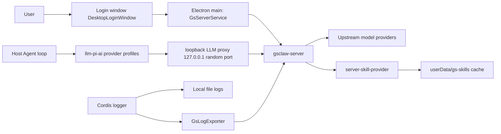

# gs-worker Server Integration

## Overview

The desktop product in this repository ships as **gs-worker**, an office Agent: `dsh-plugin-desktop` packages with `productName: gs-worker` and `appId: com.enterprise.officeagent`, the brand mark comes from `build/brand/logo.png` and `build/brand/gszq.png`, and the Web UI brand slots are filled by the Desktop-owned occupant (`src/client/desktop-brand.tsx`) while `cordis.patch.yml` disables the upstream `ui-brand-official`. The product depends on the external **gsclaw-server** (a separate repository): sign-in, models, skills, and client logs all flow through it.

All three core lanes land in the Host-owned client layer inside the Electron main process (`dsh-plugin-desktop/src/server/`); the renderer never holds a server token:

Client-layer responsibilities: `gs-endpoint.ts` resolves and validates the server endpoint; `gs-auth.ts` is the session state machine; `gs-client.ts` is the low-level HTTP client with the 401 refresh retry; `gs-config.ts` caches the server-pushed ClientConfig; `gs-brand.ts` resolves the brand (push / cache / default); `gs-contract.ts` defines every wire shape; `gs-server-service.ts` composes them into the Cordis `gsServer` service; `gs-server-route.ts` exposes the Host-private same-origin routes; `gs-llm-proxy.ts` and `gs-llm-models.ts` implement the model lane; `gs-log-exporter.ts` implements log upload.

## Sign-in and session lifecycle

The startup gate lives in `src/main.ts`: before the Host boots, a pre-boot `GsServerService` is loaded and `restoreSession()` runs; when restore fails (no refresh token, a revoked token, or a transport failure) the `DesktopLoginWindow` opens (`src/login-window.ts` + `src/native-ui/login/`), and only the user choosing Quit aborts the launch. A successful login flows straight into the same `GsServerService` instance the Host generation later uses.

Token discipline is concentrated in `src/server/gs-auth.ts`:

- **The access token lives only in process memory** and dies with the process; the renderer sees only `signed-in`/`signed-out` plus the user projection through `GsSessionView`, never a token.
- **The refresh token is a rotating, single-use credential**, sealed with Electron safeStorage into `userData/gs-refresh-token.bin` (0600, directory 0700); every refresh persists the rotated successor before the new session is considered live. When safeStorage is unavailable, login is refused (`GsAuthStorageError`), because a refresh token is never persisted in plaintext.
- **All refreshes funnel through one single-flight promise**: the server treats a concurrent refresh as token replay and revokes the whole family, so `refreshTokens()` shares one in-flight promise. A 401/403 refresh answer means the family is gone: local credential state is wiped and `onSessionLost('expired' | 'disabled')` fires.
- A legacy server that issues no rotating token pair degrades to a memory-only session ending with the process.
- A transport failure keeps the persisted refresh token: the login window still opens and renders its offline state, and the next launch retries.

Neither the login window nor the settings account page (`src/client/DesktopSettingsSection.tsx`, which shows the current user and endpoint and offers sign-out) talks to the server directly; both use the Host-private same-origin routes `/api/gs-server/*` (`src/server/gs-server-route.ts`), so credential state never leaves the main process.

## Endpoint contract

gsclaw-server endpoints the client consumes (wire shapes in `src/server/gs-contract.ts`):

| Endpoint | Purpose |
| --- | --- |
| `GET /api/v1/meta` | Public handshake; returns `serviceName`, `loginMethods`, `minimumClientVersion`, the `llmProxy` flag, and an optional `brand` |
| `GET /api/auth/methods` | Login-method switches (password / WeCom / email) |
| `GET /api/auth/captcha` | One-time graphical captcha; a 404 means the server predates captchas |
| `POST /api/auth/login` | Password login (optionally with captcha), returning the token pair, user, and ClientConfig |
| `POST /api/auth/email/send-code` | Send an email verification code |
| `POST /api/auth/email/verify` | Email-code login; the success shape matches password login |
| `POST /api/v1/auth/refresh` | Rotate the refresh token, returning the new pair and the latest ClientConfig |
| `POST /api/v1/auth/logout` | Revoke the session family server-side (best effort, local cleanup first) |
| `GET /api/client-config` | Actively pull the effective ClientConfig |
| `GET /api/skills` | Server skill catalog (enabled skills only) |
| `GET /api/skills/:name/files` | Skill bundle files (base64) for cache materialization |
| `POST /api/skills/report-installed` | Fire-and-forget installed-set report |
| `POST /api/v1/llm/:providerId/v1/chat/completions` | Model gateway, reached through the loopback proxy |
| `POST /api/logs/client` | Client runtime log batch upload |

Host-private same-origin routes for the renderer (under `/api/gs-server/`): `meta`, `captcha`, `login`, `email-code`, `email-login`, `logout`, `session`, `skills`, `brand`.

Companion additions in the gsclaw-server repository: the LLM gateway route above (which also writes `model_request_logs` and `chat_logs`), `POST /api/logs/client` backed by the `client_logs` table, the admin-side `GET /api/admin/logs/client`, and the `llmProxy: true` flag on `GET /api/v1/meta`.

Error conventions (`src/server/gs-client.ts`): legacy `/api/*` routes answer `{ error, message }`, `/api/v1/*` routes answer `{ code, message, traceId }`, and 429 adds `Retry-After`; both envelopes normalize into `GatewayError`. `authorizedJson` injects the in-memory access token and, on a `token_expired`/`token_invalid`/`unauthorized` 401, runs one single-flight refresh and retries the request exactly once.

## Model lane

The Agent loop never talks to a model provider directly. `src/server/gs-llm-proxy.ts` runs an HTTP proxy on a random `127.0.0.1` port:

- Each boot generation mints a 32-byte base64url placeholder token; the proxy accepts loopback connections only, accepts only `POST /v1/{providerId}/chat/completions`, and requires `Authorization: Bearer` to carry that placeholder token (constant-time comparison).
- On forwarding, the placeholder is swapped for the in-memory gsclaw-server access token and the request goes to `{endpoint}/api/v1/llm/{providerId}/v1/chat/completions`; SSE and JSON answers stream through without buffering, and a client disconnect aborts the upstream read.
- An upstream 401 buys one single-flight refresh and exactly one retry; a second 401 passes through untouched.

`src/server/gs-llm-models.ts` turns the server ClientConfig `models` section into executable configuration: `planGsLlmModelProfile` generates one `llm-pi-ai` provider profile per server provider (`api: openai-completions`, `baseURL` pointing at the proxy's `/v1/{providerId}`) and resolves `defaultPrimary` into the `agent-default-model` selection; `mirrorGsLlmModelSettings` owns the settings document's `llm-pi-ai:`, `llm-deepseek:` (removed), and `agent-default-model:` sections outright, and a push that changes nothing never triggers a rewrite. The settings file is hot-reloaded, so a mirrored update reaches the running adapter without a restart.

No key touches disk: the settings document carries only the credential reference `apiKeyEnv: DSH_DESKTOP_LLM_PROXY_TOKEN`; the placeholder token itself lives solely in the launch-environment memory snapshot (`gsLlmProxyLaunchEnvironment`) — never written to disk and never materialized into `process.env`, so sandboxed tool subprocesses cannot inherit it, while `ctx.credentials` and the pi-ai adapter's launch-environment fallback both resolve it.

Composition adds two more gates: `cordis.patch.yml` disables `llm-deepseek` (the direct adapter would bypass the proxy) and `ui-settings-models` (the Models page would hold provider keys on the client); `filterLlmPatches` in `src/profile.ts` strips every mention of these identities from user and home patch layers, and `assertEffectiveLlmRows` asserts after composition that no disabled row revived and that the `llm-pi-ai` / `agent-default-model` rows keep their canonical package identities. Even a server-pushed `features.customModel: true` only logs — apiKeys never leave the server, so custom model settings stay disabled.

## Skill lane

Local skill discovery is banned in the desktop product; skills arrive from the server alone. The ban is enforced by three gates:

1. **Patch disable**: the `skill-filesystem` row carries `disabled: true` in `cordis.patch.yml` (the launcher-owned desktop layer — the first gate).
2. **Profile stripping and assertion**: `filterLocalSkillPatches` in `src/profile.ts` removes every insert/override/enable of that identity from each non-desktop patch layer; `assertEffectiveSkillRows` then asserts the composed graph holds no enabled `skill-filesystem` row and refuses to boot otherwise.
3. **Preset sanitization**: `materializeDesktopPresetRoot` copies the shipped preset root into a profile-private directory, skipping every preset's `skills/` directory and rewriting its composition file with `stripLocalSkillCompositionRows`; the agent-presets row composes with `includeShippedRoot: false` and `includeUserRoot: false`, so user-authored preset roots no longer enter the roster.

`tool-skill` (the model-facing skill catalog and loader, consuming only the `ctx.skills` registry) is not banned: presets mount it per agent so the server-delivered catalog reaches each agent; `assertEffectiveSkillRows` also pins it to its canonical package `@deepseek-ai/dsh-tool-skill`, refusing to boot if any surviving row was swapped for a same-named impostor.

Server skills come from `src/server-skill-provider.ts`: it registers into the Host's `ctx.skills` registry at rank `BUNDLED_SKILL_RANK + 100` (i.e. 700), so no residual local source can win a duplicate name. The catalog comes from `GET /api/skills`, then filtered subtractively by the ClientConfig `skills` switches: the reserved master key `SKILLs` (mixed case, not a valid skill name, so it never collides with a real skill) set to `off` disables the whole skill feature and empties the catalog; per skill, only an explicit `off` removes it from the catalog, while `on` or an unlisted skill follows the delivered catalog (`/api/skills` already only carries enabled, authorization-filtered skills) — the switch table is not a whitelist. Bundles materialize from `GET /api/skills/:name/files` into `<userData>/gs-skills/<name>@<version>` — the files response gets a raised 42 MiB gateway byte cap (base64 inflates ~4/3 over the 30 MiB bundle ceiling; every other endpoint keeps the default 1 MiB), and strict base64 validation is a linear scan rather than a regex (multi-MiB payloads overflow the regex engine stack); paths must be relative and free of `.`/`..` segments, each file ≤ 8 MiB, the bundle ≤ 30 MiB and ≤ 500 files, and a bundle without `SKILL.md` is refused. Writes stage beside the target, mark `.complete` last, and rename into place, so a crash never leaves a loadable partial directory; superseded versions are removed once the new one lands. With no session or an unreachable server the catalog is empty and Host startup is never blocked. After each catalog change, one deduplicated best-effort report goes to `POST /api/skills/report-installed`.

The provider also maintains a synchronization snapshot (the `gsSkillSync` tracker): the status, success timestamp, and lite skill list of the latest `GET /api/skills`, plus `masterOff` (whether the master switch is off) and `switchedOff` (how many delivered skills a per-skill `off` suppressed), keeping the last good snapshot and writing one `warn` log line when a fetch fails. The settings page's Skills section (`src/client/DesktopSkillsSection.tsx`) shows this server-delivered skill list and the last sync time, read through the private same-origin route `GET /api/gs-server/skills`, so the renderer never touches a token here either. Empty states are distinguished by priority: `masterOff` shows "The server has disabled the skill feature"; an empty catalog with suppressed skills shows the count ("N skills have been switched off by server controls"); otherwise "The server has not delivered any skills yet"; and a non-empty catalog with suppressed skills appends one hint line with the count.

## Log lane

Logs travel three independent paths:

1. **Model request logs**: the gsclaw-server LLM gateway writes `model_request_logs` and `chat_logs` server-side; the loopback proxy only streams and records no request content on the client.
2. **Client log upload**: `src/server/gs-log-exporter.ts` is a Cordis exporter coexisting with the local `FileExporter`; it buffers rendered, `mask-secrets`-masked messages and posts batches to `POST /api/logs/client` (flush at 50 records or every 10 seconds; at most 200 records and 192 KB per batch; a 2000-record queue drops the oldest on overflow). Uploads are strictly best-effort: a failed batch is discarded without retry, and shutdown grants one final flush a two-second grace; uploader diagnostics go straight to the local file sink so they never recurse through `ctx.logger`. The server stores them in the `client_logs` table, surfaced to admins through `GET /api/admin/logs/client`.
3. **Local file logs are unchanged**: `userData/logs/dsh-YYYY-MM-DD.log` (plus `.error.log`) still rotates at 10 MiB, keeps seven days, and stays under 200 MiB, with `dsh-desktop.logLevel` controlling verbosity.

## Application update delivery

The ClientConfig `appUpdate` field (`GsAppUpdateConfig`, `src/server/gs-contract.ts`) is pushed by the server inside login, refresh, and `GET /api/client-config` responses, carrying one new-version notice: `version` (a plain dotted-number version), optional `notes` (one line per release note), `downloads` (per-platform direct installer links: `windowsX64` / `macArm` / `macIntel`), optional `availableFrom` (when downloads open), and an optional `downloadWindow` (automatic-download hours). `null` or absent means no update prompt.

The client consumption lane: the `desktop-server-updates` plugin (`dsh-plugin-desktop/src/server-updates.ts`, mounted in `cordis.patch.yml`, `inject = ['desktopRuntime', 'gsServer']`) subscribes to the `ctx.gsServer.config` push snapshots and additionally pulls `/api/client-config` every 5 minutes (`pullIntervalMs`) — the first pull runs 15 seconds after boot (`initialPullDelayMs`) so a `restoreSession()` push can arrive first; pull failures (signed-out or offline) stay completely silent. Every snapshot passes through `src/server-app-update.ts`: `parseServerAppUpdate` defensively parses the wire JSON (the version must be canonical numeric SemVer, links must be credential-free http(s), and notes/availableFrom/downloadWindow are shape-checked; any malformed field voids the whole notice — never prompt, never crash), then `evaluateServerAppUpdate` decides:

- no `appUpdate`, a version not newer than the installed one, or no download for the current platform/arch → no action;
- `now < availableFrom` → notify-only: the dialog has no download button and only states when downloads open;
- otherwise a native dialog shows (title plus the notes as body lines, with an "Upgrade" primary button), and choosing "Upgrade" runs the whole upgrade automatically; "Later" suppresses repeat prompts for that version within the same run (in-memory dedup; the next launch prompts again).

Download and install discipline: the installer is GET'd from the `downloads` direct link — no login required, no `X-DSH-*` headers, no echoed-header validation (the gsclaw-server static directory does not echo them); writing reuses the community channel's defenses: the 1 GiB size cap, PE/DMG magic validation, and temporary-file plus rename atomic completion (`downloadDesktopUpdateFromUrl`, `src/update-download.ts`). After the "Upgrade" confirmation there is no further interaction: no save dialog, and the installer always lands in the managed `updates/` directory below userData (a 0700 private directory, `desktopUpdateManagedDirectory`; the filename defaults to the link's basename, falling back to the generated `gs-worker-<version>-<platform>.<ext>` on unsafe characters or a mismatched extension), with a system notification when the download starts. On completion, Windows skips the "Restart and Install" confirmation: the installer is launched in NSIS `/S` silent mode and the app exits (keeping `--updated --force-run`, so the installer relaunches the upgraded app); macOS cannot install a DMG silently, so the DMG opens automatically with an instructions dialog for a manual drag-install. Download failures (network/validation/cancellation) never open a dialog — they log and post a failure notification. Server-channel artifacts are recorded with a `managed: true` flag (`recordDesktopUpdateArtifact`); on the first launch after the upgrade, `performUpdateArtifactCleanup` deletes the leftover installer silently, while community-channel artifacts downloaded to a user-chosen path carry no flag and still ask "Delete Installer?" as before. `downloadWindow` gets no automatic downloads: the only download trigger in this client is the one "Upgrade" click, and the server contract exempts manual downloads from the window, so the field is only shape-validated and never evaluated. When the adapter is not injected (`serverUpdates` missing) or the build cannot download (`canDownload === false`), one log line is written instead of a prompt; a signed-out (cleared) snapshot never acts.

## Configuration and operations

Endpoint resolution precedence (`src/server/gs-endpoint.ts`, read per request so overrides apply live):

1. Runtime override: `gs-endpoint.json` below userData (0600 atomic write; corrupt or out-of-bounds state is ignored);
2. The `GSCLAW_ENDPOINT` environment variable (the development and packaging seam);
3. The built-in default `http://192.168.230.108:8151/gsworker`.

The endpoint must be an absolute http(s) URL without embedded credentials, query, or fragment; plain HTTP is accepted only for loopback and private LAN hosts (`localhost`, `::1`, `127.*`, `192.168.*`, `10.*`), and every other authority requires HTTPS.

Environment conventions: `GSCLAW_ENDPOINT` overrides the default endpoint; `DSH_DESKTOP_LLM_PROXY_TOKEN` exists only as an in-memory launch-environment entry and must not — and cannot — be set on disk by operations.

Login and refresh responses push the ClientConfig (cached and subscribable in `src/server/gs-config.ts`): `agent` (sandboxProfile / approvalPolicy / dataClass), `features.customModel`, `settingsPages`, `permissions`, `skills` switches, `models`, `appUpdate`, `notice`, and `brand`. With no session, the LLM proxy answers 401, the skill catalog is empty, and log upload silently drops — none of which blocks local functionality.

### Brand delivery

The ClientConfig `brand` field (`{ name?, headline? } | null`, single-language, never translated per locale) configures the desktop product's brand name and the welcome hero headline; admins change it through the existing `PUT /api/admin/client-config` merge semantics, with no new endpoint. The client resolution chain (`src/server/gs-brand.ts`): **the ClientConfig push wins**, then the `gs-brand.json` cache below userData (the same hardened read/write bar as `gs-endpoint.json`: 0600 atomic write, lstat/bounded read/shape validation, corrupt state ignored), then the built-in defaults (`办公 Agent` / `探索未至之境`). The login-exempt `GET /api/v1/meta` may also carry `brand` before sign-in; a successful `getMeta()` updates the store and persists the cache, while servers that predate the field simply omit it and the client falls back to the default copy everywhere. Every effective change syncs the in-process holder (`src/brand.ts`); the main-process copy modules (`native-dialog-copy.ts`, `recovery-copy.ts`, `setup-wizard-copy.ts`, `login-copy.ts`, `tray-locale.ts`, `update-lifecycle.ts`, `notifications.ts`, `workspace-admission.ts`, plus the main window title) embed a `{brand}` placeholder resolved through `interpolateBrand`.

The renderer never holds the ClientConfig directly: the Host exposes the same-origin route `GET /api/gs-server/brand` (`GsBrandView`) with a strict parser in `src/client/gs-brand-api.ts`; the sidebar brand name (`desktop-brand.tsx`) and the settings/skills pages' wrapped `t()` fetch it on mount and fall back to the locale dictionary on failure. The upstream hero has no text slot, so `patches/dsh-client-ui-conversation@0.1.2-alpha.1.patch` makes `EmptyHero` read `globalThis.__GS_BRAND_HEADLINE__` first (written by the desktop client entry before conversation mounts) and otherwise fall back to the upstream locale dictionary. Permission preset names use the same injection mechanism: `src/client/permission-labels.ts` writes the Chinese label map (keyed by preset value) to `globalThis.__GS_PERMISSION_LABELS__` before conversation mounts, and `patches/dsh-client-ui-conversation@0.1.2-alpha.1.patch` plus `patches/dsh-client-ui-permission-presets@0.1.2-alpha.1.patch` make the composer permission chip, the `/permission` popup, and the settings default-permission row read that map first, falling back to the upstream English transforms for unmapped values. Brand changes do not hot-update open window titles; every renderer surface picks them up on its next mount or launch.

## Compatibility notes

- **Compatibility mode is unaffected**: the `dsh-desktop.mode` compatibility/extended/enhanced presentation compositions are orthogonal to this rework; however, the login gate runs before Host boot, so no mode enters the shell without a valid session.
- **User-authored presets no longer appear in the roster**: the preset root is replaced by the sanitized copy, and `includeUserRoot: false` means preset directories the user created are no longer discovered.
- **The userData directory is renamed**: with `productName` now `gs-worker`, Electron userData moves (to `%APPDATA%\gs-worker` on Windows and `~/Library/Application Support/gs-worker` on macOS); local state in the old `DSH Desktop` userData — the sealed refresh token, the endpoint override, the skill cache, logs, and diagnostics — is not migrated, so first launch is equivalent to a fresh install.
- **Local model and skill configuration is void**: the settings document's `llm-deepseek:` section is deleted on every boot or ClientConfig push, and `llm-pi-ai:` plus `agent-default-model:` are owned outright by the mirror, so a manual edit survives only until the next mirror.

## Further reading for maintainers

- [Server client-layer entry](../dsh-plugin-desktop/src/server/gs-server-service.ts)
- [Session state machine](../dsh-plugin-desktop/src/server/gs-auth.ts)
- [Loopback LLM proxy](../dsh-plugin-desktop/src/server/gs-llm-proxy.ts)
- [Model settings mirror](../dsh-plugin-desktop/src/server/gs-llm-models.ts)
- [Server skill provider](../dsh-plugin-desktop/src/server-skill-provider.ts)
- [Client log upload](../dsh-plugin-desktop/src/server/gs-log-exporter.ts)
- [Server app-update evaluation](../dsh-plugin-desktop/src/server-app-update.ts)
- [Profile composition gates and assertions](../dsh-plugin-desktop/src/profile.ts)
- [Desktop architecture](architecture.en.md)
