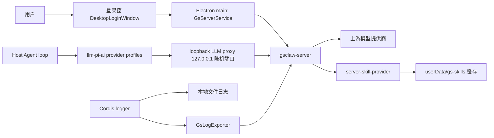

# gs-worker 服务端集成

## 总览

本仓库的桌面产品以 **gs-worker**(办公 Agent)形态发布:`dsh-plugin-desktop` 的打包配置使用 `productName: gs-worker` 与 `appId: com.enterprise.officeagent`,品牌标来自 `build/brand/logo.png` 与 `build/brand/gszq.png`;Web UI 的品牌槽由 Desktop 自有 occupant(`src/client/desktop-brand.tsx`)填充,`cordis.patch.yml` 禁用了上游 `ui-brand-official`。产品运行依赖外部服务端 **gsclaw-server**(独立仓库):登录、模型、技能与客户端日志都经由它。

三条核心链路都先落到 Electron main 进程里的 Host 自有客户端层(`dsh-plugin-desktop/src/server/`),渲染进程永远不持有服务端令牌:

客户端层各模块的职责:`gs-endpoint.ts` 解析并校验服务端端点;`gs-auth.ts` 是会话状态机;`gs-client.ts` 是底层 HTTP 客户端与 401 刷新重试;`gs-config.ts` 缓存服务端推送的 ClientConfig;`gs-brand.ts` 解析品牌(推送 / 缓存 / 默认);`gs-contract.ts` 定义全部线上契约;`gs-server-service.ts` 把三者组合成 Cordis `gsServer` service;`gs-server-route.ts` 暴露 Host 私有同源路由;`gs-llm-proxy.ts` 与 `gs-llm-models.ts` 实现模型链路;`gs-log-exporter.ts` 实现日志上传。

## 登录与会话生命周期

启动门控位于 `src/main.ts`:Host 启动前先加载 pre-boot 的 `GsServerService` 并尝试 `restoreSession()`;恢复失败(无刷新令牌、令牌已被吊销,或传输故障)时打开 `DesktopLoginWindow`(`src/login-window.ts` + `src/native-ui/login/`),用户在登录窗选择退出才会终止启动。登录成功后,同一个 `GsServerService` 实例直接流入 Host generation。

令牌纪律集中在 `src/server/gs-auth.ts`:

- **access token 只在进程内存**,随进程结束消失;渲染进程经 `GsSessionView` 只看到 `signed-in`/`signed-out` 与用户信息,永远拿不到令牌。
- **refresh token 是旋转的单次凭证**,用 Electron safeStorage 密封后写入 `userData/gs-refresh-token.bin`(0600,目录 0700);每次刷新先把旋转后的后继令牌落盘,才把新会话视为生效。safeStorage 不可用时拒绝登录(`GsAuthStorageError`),因为刷新令牌不允许明文持久化。
- **所有刷新经过单飞(single-flight)**:服务端把并发刷新视为令牌重放并吊销整个会话族,所以 `refreshTokens()` 共享同一个 in-flight promise。刷新收到 401/403 表示会话族已失效:清空本地凭证并触发 `onSessionLost('expired' | 'disabled')`。
- 旧版服务端不签发旋转令牌对时,退化为纯内存会话,进程结束即失效。
- 传输故障不清除已持久化的刷新令牌:登录窗仍会打开并呈现离线状态,下次启动再试。

登录窗与设置区账号页(`src/client/DesktopSettingsSection.tsx`,显示当前用户与端点、提供退出登录)都不直接访问服务端;它们走 Host webServer 上的私有同源路由 `/api/gs-server/*`(`src/server/gs-server-route.ts`),由 main 进程代为持有凭证。

## 端点契约

客户端消费的 gsclaw-server 端点(契约形状见 `src/server/gs-contract.ts`):

| 端点 | 用途 |
| --- | --- |
| `GET /api/v1/meta` | 公开握手;返回 `serviceName`、`loginMethods`、`minimumClientVersion`、`llmProxy` 标记与可选的 `brand` |
| `GET /api/auth/methods` | 登录方式开关(密码 / 企业微信 / 邮箱) |
| `GET /api/auth/captcha` | 一次性图形验证码;服务端未实现时按 404 视为无验证码 |
| `POST /api/auth/login` | 密码登录(可带验证码),返回令牌对、用户与 ClientConfig |
| `POST /api/auth/email/send-code` | 发送邮箱验证码 |
| `POST /api/auth/email/verify` | 邮箱验证码登录,成功形状与密码登录一致 |
| `POST /api/v1/auth/refresh` | 旋转刷新令牌,返回新令牌对与最新 ClientConfig |
| `POST /api/v1/auth/logout` | 服务端吊销会话族(尽力而为,本地优先清理) |
| `GET /api/client-config` | 主动拉取生效 ClientConfig |
| `GET /api/skills` | 服务端技能目录(只下发启用的技能) |
| `GET /api/skills/:name/files` | 技能 bundle 文件(base64),用于物化本地缓存 |
| `POST /api/skills/report-installed` | 已装技能集合的 fire-and-forget 上报 |
| `POST /api/v1/llm/:providerId/v1/chat/completions` | 模型网关,由 loopback 代理转发 |
| `POST /api/logs/client` | 客户端运行日志批量上传 |

Host 侧私有同源路由(渲染进程专用,`/api/gs-server/`):`meta`、`captcha`、`login`、`email-code`、`email-login`、`logout`、`session`、`skills`、`brand`。

gsclaw-server 仓库的配套新增:上述 LLM 网关路由(同时落 `model_request_logs` 与 `chat_logs`)、`POST /api/logs/client` 与 `client_logs` 表、管理侧 `GET /api/admin/logs/client`,以及 `GET /api/v1/meta` 的 `llmProxy: true` 标记。

错误约定(`src/server/gs-client.ts`):legacy `/api/*` 返回 `{ error, message }`,`/api/v1/*` 返回 `{ code, message, traceId }`,429 附 `Retry-After`;两者统一归一为 `GatewayError`。`authorizedJson` 注入内存 access token,遇到 `token_expired`/`token_invalid`/`unauthorized` 的 401 时经单飞刷新后原样重试一次。

## 模型链路

Agent loop 从不直连模型提供商。`src/server/gs-llm-proxy.ts` 在本机 `127.0.0.1` 随机端口起一个 HTTP 代理:

- 每个 boot generation 铸造一个 32 字节 base64url 占位令牌;代理只接受 loopback 连接、只接受 `POST /v1/{providerId}/chat/completions`,且要求 `Authorization: Bearer` 携带该占位令牌(常量时间比较)。
- 转发时把占位令牌换成内存中的 gsclaw-server access token,请求 `{endpoint}/api/v1/llm/{providerId}/v1/chat/completions`;SSE 与 JSON 响应都不缓冲透传,客户端断开会中止上游读取。
- 上游 401 触发一次单飞刷新并重试一次;第二次 401 原样透传给调用方。

`src/server/gs-llm-models.ts` 负责把服务端 ClientConfig 的 `models` 节变成可执行配置:`planGsLlmModelProfile` 为每个服务端 provider 生成 `llm-pi-ai` provider profile(`api: openai-completions`,`baseURL` 指向代理的 `/v1/{providerId}`),并把 `defaultPrimary` 解析为 `agent-default-model` 的默认选择;`mirrorGsLlmModelSettings` 整体拥有 settings 文档的 `llm-pi-ai:`、`llm-deepseek:`(删除)与 `agent-default-model:` 三节,无变化的推送不会触发重写。settings 文件热加载,镜像更新无需重启即到达运行中的适配器。

密钥不落盘:settings 文档里只写 credential 引用 `apiKeyEnv: DSH_DESKTOP_LLM_PROXY_TOKEN`;占位令牌本身只存在于 launch-environment 内存快照(`gsLlmProxyLaunchEnvironment`),既不写盘也不进入 `process.env`,因此沙箱工具子进程无法继承,而 `ctx.credentials` 与 pi-ai 适配器的 launch-environment 回退都能解析到它。

组成侧还有两道闸门:`cordis.patch.yml` 禁用 `llm-deepseek`(直连适配器会绕过代理)与 `ui-settings-models`(模型设置页会把 provider 密钥留在客户端);`src/profile.ts` 的 `filterLlmPatches` 从用户与 home patch 层剥离这些身份的所有提及,`assertEffectiveLlmRows` 在合成后断言被禁行没有复活、且 `llm-pi-ai` / `agent-default-model` 行保持 canonical 包身份。服务端即使推送 `features.customModel: true` 也只记录日志——apiKey 不出服务端,自定义模型设置保持禁用。

## 技能链路

桌面产品禁止本地技能发现,技能只从服务端下发。禁令由三道闸执行:

1. **patch 禁用**:`cordis.patch.yml` 中 `skill-filesystem` 行 `disabled: true`(launcher 自有 desktop 层,是第一道闸)。
2. **profile 剥离与断言**:`src/profile.ts` 的 `filterLocalSkillPatches` 从每个非 desktop patch 层剥掉该身份的 insert/override/enable;`assertEffectiveSkillRows` 在合成图上断言不存在启用状态的 `skill-filesystem` 行,违反即拒绝启动。
3. **preset 净化**:`materializeDesktopPresetRoot` 把随附 preset 根拷贝到 profile 私有目录时跳过每个 preset 的 `skills/` 目录,并用 `stripLocalSkillCompositionRows` 重写其 composition 文件;agent-presets 行以 `includeShippedRoot: false`、`includeUserRoot: false` 组合,用户自带 preset 根不再进入 roster。

`tool-skill`(面向模型的技能目录与加载器,只消费 `ctx.skills` 注册表)不在禁令内:preset 按 agent 挂载它,服务端技能目录经它到达 agent;`assertEffectiveSkillRows` 同时钉住其 canonical 包名 `@deepseek-ai/dsh-tool-skill`,任何存活行若被换成同名伪装实现即拒绝启动。

服务端技能由 `src/server-skill-provider.ts` 提供:它注册进 Host 的 `ctx.skills` registry,rank 取 `BUNDLED_SKILL_RANK + 100`(即 700),保证任何残留本地源都无法以同名技能胜出。目录来自 `GET /api/skills`,再按 ClientConfig 的 `skills` 开关做减法过滤:保留总开关键 `SKILLs`(含大写字母,不是合法技能名,天然不与真实技能冲突)为 `off` 时整个技能功能被禁用、目录为空;逐技能只有显式 `off` 才把该技能移出目录,`on` 或未列出都跟随服务端下发目录(`/api/skills` 本身已只含 enabled 且经授权过滤的技能)——开关表不是白名单。bundle 经 `GET /api/skills/:name/files` 物化到 `<userData>/gs-skills/<name>@<version>`——该响应走网关客户端时上限放宽到 42 MiB(base64 约 4/3 膨胀,覆盖 30 MiB 整包上限;其余接口仍默认 1 MiB),base64 严格校验用线性扫描而非正则(多 MiB 负载会撑爆正则栈);路径必须是不含 `.`/`..` 段的相对路径,单文件 ≤ 8 MiB、整包 ≤ 30 MiB、≤ 500 个文件,缺少 `SKILL.md` 的包拒收;写入采用 staging 目录加 `.complete` 标记后 rename,崩溃不会留下可加载的半成品,同技能旧版本随即清理。无会话或服务端不可达时目录为空,绝不阻塞 Host 启动。每次目录变化后向 `POST /api/skills/report-installed` 做一次去重后的尽力上报。

provider 同时维护一份同步快照(`gsSkillSync` tracker):记录最近一次 `GET /api/skills` 的状态、成功时间、技能 lite 列表,以及 `masterOff`(总开关是否关闭)与 `switchedOff`(被逐技能 `off` 挡掉的技能数),拉取失败时保留上次成功快照并写一条 `warn` 日志。设置页的"技能"区块(`src/client/DesktopSkillsSection.tsx`)展示这份服务器下发技能列表与最近同步时间,数据经私有同源路由 `GET /api/gs-server/skills` 读取,渲染进程同样不接触令牌。空态按优先级区分:`masterOff` 时提示"服务端已禁用技能功能";目录为空但有技能被管控关闭时提示数量("N 个技能被服务端管控关闭");否则提示"服务器暂未下发技能";目录非空且有被挡技能时追加一行数量提示。

## 日志链路

日志有三条互不影响的去向:

1. **模型请求日志**:由 gsclaw-server 的 LLM 网关在服务端落 `model_request_logs` 与 `chat_logs`;loopback 代理只透传,不在客户端记录请求内容。
2. **客户端日志上传**:`src/server/gs-log-exporter.ts` 是一个与本地 `FileExporter` 并存的 Cordis exporter,把渲染后经 `mask-secrets` 脱敏的消息缓冲成批,`POST /api/logs/client`(满 50 条或每 10 秒触发;每批 ≤ 200 条且 ≤ 192 KB,队列上限 2000 条,溢出丢最旧)。上传严格尽力而为:失败批次直接丢弃不重试,进程退出前给最后一次 flush 2 秒宽限;上传器自身的诊断只写本地文件日志,避免经 `ctx.logger` 递归。服务端写入 `client_logs` 表,管理侧经 `GET /api/admin/logs/client` 查看。
3. **本地文件日志不变**:仍写 `userData/logs/dsh-YYYY-MM-DD.log`(及 `.error.log`),10 MiB 轮转、保留七天、总量 200 MiB 上限,`dsh-desktop.logLevel` 控制详细程度。

## 应用更新下发

ClientConfig 的 `appUpdate` 字段(`GsAppUpdateConfig`,`src/server/gs-contract.ts`)由服务端在登录、刷新与 `GET /api/client-config` 中下发,承载一条新版本通知:`version`(纯数字分段版本)、可选 `notes`(逐条更新说明)、`downloads`(按平台划分的安装包直链:`windowsX64` / `macArm` / `macIntel`)、可选 `availableFrom`(开放下载时间)与可选 `downloadWindow`(自动下载时段)。`null` 或缺失表示不下发更新提示。

客户端消费链:`desktop-server-updates` 插件(`dsh-plugin-desktop/src/server-updates.ts`,在 `cordis.patch.yml` 中挂载,`inject = ['desktopRuntime', 'gsServer']`)订阅 `ctx.gsServer.config` 的推送快照,并每 5 分钟(`pullIntervalMs`)主动拉一次 `/api/client-config`——启动后 15 秒首拉(`initialPullDelayMs`),给 `restoreSession()` 的推送留出先到的时间;拉取失败(未登录/离线)完全静默。每次快照到达都经 `src/server-app-update.ts` 处理:`parseServerAppUpdate` 对线上 JSON 做防御性解析(版本必须是规范化纯数字 SemVer、直链必须是 http(s) 且无内嵌凭据、notes/availableFrom/downloadWindow 形状校验,任何字段非法整体视为无更新,宁可不提示不可崩溃),`evaluateServerAppUpdate` 再做评估:

- `appUpdate` 为空、版本不高于当前、或当前平台/arch 无下载地址 → 不动作;
- `now < availableFrom` → 只提示(notify-only),对话框没有下载按钮,仅说明何时开放下载;
- 否则弹原生对话框(标题 + notes 逐条正文,主按钮为"升级"),用户点"升级"后全自动完成升级,点"稍后"本次运行内不再重复提示(内存去重,下次启动重新提示)。

下载与安装纪律:安装包从 `downloads` 直链直接 GET——无需登录、不带 `X-DSH-*` 头、不校验回显头(gsclaw-server 静态目录不回显);写盘复用社区通道同一套防线:1 GiB 大小上限、PE/DMG 魔数校验、临时文件 + rename 原子完工(`downloadDesktopUpdateFromUrl`,`src/update-download.ts`)。确认"升级"后不再有任何交互:不弹保存对话框,安装包固定下载到 userData 下的 `updates/` 管理目录(0700 私有目录,`desktopUpdateManagedDirectory`;默认文件名取直链 basename,非法字符或扩展名不符时回退到生成的 `gs-worker-<version>-<platform>.<ext>`),下载开始时发一条系统通知。下载完成后:Windows 不弹"重启并安装"确认,直接以 NSIS `/S` 静默模式拉起安装器并退出应用(保留 `--updated --force-run`,装完自动启动新版);macOS 无法静默安装 DMG,自动打开 DMG 并弹说明对话框,由用户手工拖装。下载失败(网络/校验/取消)不弹窗,只记日志并发一条失败系统通知。服务端通道下载的 artifact 记录带 `managed: true` 标记(`recordDesktopUpdateArtifact`),升级后的下次启动由 `performUpdateArtifactCleanup` 静默删除残留安装包;社区通道用户自选路径下载的 artifact 不带该标记,仍按原行为弹"删除安装包?"询问。`downloadWindow` 不实现自动下载:本客户端的下载触发点就是"升级"按钮这一次确认,服务端契约明确手动下载不受时段限制,因此该字段只做形状校验、不参与评估。适配器未注入(`serverUpdates` 缺失)或当前构建不可下载(`canDownload === false`)时只写一条日志,不弹框;登出清空快照后不动作。

## 配置与运维

端点解析优先级(`src/server/gs-endpoint.ts`,每次请求时读取,覆盖即时生效):

1. 运行时覆盖:userData 下的 `gs-endpoint.json`(0600 原子写,损坏或越界即忽略);
2. 环境变量 `GSCLAW_ENDPOINT`(开发与打包 seam);
3. 内置默认 `http://192.168.230.108:8151/gsworker`。

端点必须是绝对 http(s) URL,不允许内嵌凭据、query 或 fragment;纯 http 只接受 loopback 与内网网段(`localhost`、`::1`、`127.*`、`192.168.*`、`10.*`),其他地址必须 https。

环境变量约定:`GSCLAW_ENDPOINT` 覆盖默认端点;`DSH_DESKTOP_LLM_PROXY_TOKEN` 只作为内存 launch-environment 项存在,运维侧不应也无法在磁盘上设置它。

登录与刷新响应会推送 ClientConfig(`src/server/gs-config.ts` 缓存,可订阅):`agent`(sandboxProfile / approvalPolicy / dataClass)、`features.customModel`、`settingsPages`、`permissions`、`skills` 开关、`models`、`appUpdate`、`notice` 与 `brand`。无会话时 LLM 代理回 401、技能目录为空、日志上传静默丢弃——三者都不阻塞本地功能。

### 品牌下发

ClientConfig 的 `brand` 字段(`{ name?, headline? } | null`,单语言、不随 locale 翻译)配置桌面产品的品牌名与欢迎页大标题;管理端经既有 `PUT /api/admin/client-config` 合并修改,无需新端点。客户端解析链(`src/server/gs-brand.ts`):**ClientConfig 推送优先**,其次 userData 下的 `gs-brand.json` 缓存(与 `gs-endpoint.json` 同级的硬化读写:0600 原子写、lstat/有界读/形状校验,损坏即忽略),最后是内置默认(`办公 Agent` / `探索未至之境`)。登录窗之前的免登录 `GET /api/v1/meta` 同样可携带 `brand`,`getMeta()` 成功即更新 store 并落缓存,服务端未上线该字段时自动省略、客户端全部回退默认文案。每次生效值变化都会同步进程内 holder(`src/brand.ts`),主进程文案模块(`native-dialog-copy.ts`、`recovery-copy.ts`、`setup-wizard-copy.ts`、`login-copy.ts`、`tray-locale.ts`、`update-lifecycle.ts`、`notifications.ts`、`workspace-admission.ts` 与主窗口标题)统一以 `{brand}` 占位符经 `interpolateBrand` 解析。

渲染进程不直接持有 ClientConfig:Host 暴露同源路由 `GET /api/gs-server/brand`(`GsBrandView`),`src/client/gs-brand-api.ts` 提供严格解析器;侧边栏品牌名(`desktop-brand.tsx`)与设置/技能页的 `t()` 包装在挂载时拉取,失败回退字典默认。欢迎页大标题上游无槽位,由 `patches/dsh-client-ui-conversation@0.1.2-alpha.1.patch` 让 `EmptyHero` 优先读 `globalThis.__GS_BRAND_HEADLINE__`(桌面 client 入口在挂载 conversation 前写入),未设置时回退上游 locale 字典。权限预设名称走同一注入机制:`src/client/permission-labels.ts` 在挂载 conversation 前把中文名映射(键为预设值)写入 `globalThis.__GS_PERMISSION_LABELS__`,`patches/dsh-client-ui-conversation@0.1.2-alpha.1.patch` 与 `patches/dsh-client-ui-permission-presets@0.1.2-alpha.1.patch` 让 composer 权限下拉、`/permission` 弹层和设置页默认权限行优先读该映射,未覆盖的键回退上游英文变换。品牌变更对已开窗口标题不做热更新,各渲染面在下次挂载/启动时生效。

## 兼容性说明

- **兼容模式不受影响**:`dsh-desktop.mode` 的 compatibility/extended/enhanced 展示组合与本改造正交;但登录门控位于 Host boot 之前,任何模式下没有有效会话都无法进入 shell。
- **用户自作者 preset 不再出现在 roster**:preset 根被净化拷贝取代,`includeUserRoot: false` 意味着用户目录下自建的 preset 不再被发现。
- **userData 目录更名**:`productName` 变为 `gs-worker` 后,Electron userData 随之更名(Windows 为 `%APPDATA%\gs-worker`,macOS 为 `~/Library/Application Support/gs-worker`);旧 `DSH Desktop` userData 中的本地位——密封刷新令牌、端点覆盖、技能缓存、日志与诊断——不做迁移,首次启动等价于全新安装。
- **本地模型与技能配置失效**:settings 中的 `llm-deepseek:` 节在每次 boot 或 ClientConfig 推送时被删除,`llm-pi-ai:` 与 `agent-default-model:` 由镜像整体拥有,用户手改只维持到下次镜像。

## 维护者深入阅读

- [服务端客户端层入口](../dsh-plugin-desktop/src/server/gs-server-service.ts)
- [会话状态机](../dsh-plugin-desktop/src/server/gs-auth.ts)
- [loopback LLM 代理](../dsh-plugin-desktop/src/server/gs-llm-proxy.ts)
- [模型 settings 镜像](../dsh-plugin-desktop/src/server/gs-llm-models.ts)
- [服务端技能 provider](../dsh-plugin-desktop/src/server-skill-provider.ts)
- [客户端日志上传](../dsh-plugin-desktop/src/server/gs-log-exporter.ts)
- [服务端应用更新评估](../dsh-plugin-desktop/src/server-app-update.ts)
- [profile 组成闸门与断言](../dsh-plugin-desktop/src/profile.ts)
- [桌面架构](architecture.md)
