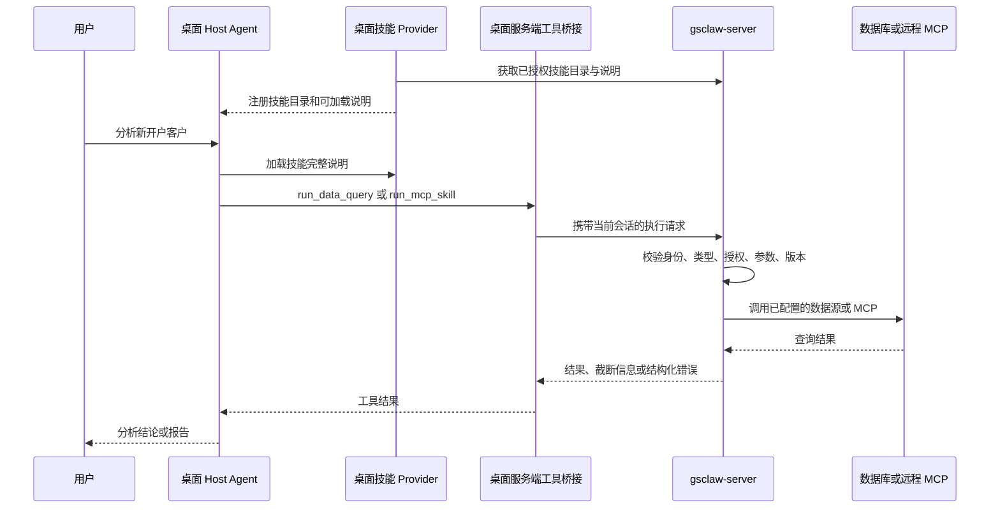

# 服务端 Skill 执行对接方案

状态：待评审，尚未实施。日期：2026-09-07。

适用仓库：`D:\dsh-desktop`、`D:\gsclaw-server`。

## 1. 建议与目标

沿用现有 `runtime` 执行类型标记，在桌面端增加服务端工具调用桥接。Agent 的对话、规划和结果分析继续在桌面 Host 中编排；数据库查询与远程 MCP 调用由 gsclaw-server 执行。

建议先完成 `data-query`，以 `new-account-customer-analysis` 作为候选验收技能，再接入 `server-mcp`。不需要为此修改 DeepSeek Harness 上游代码，也不需要把整个桌面对话迁移到服务端 Agent。

本方案只交付设计文档，不修改技能记录、数据库、凭据或运行时配置。文档中的新接口及报文均为建议契约，不代表当前已经可调用。

## 2. 已核实的现状

| 范围 | 现有实现 | 缺口或影响 |
| --- | --- | --- |
| 技能类型 | 数据库已有 `runtime_type`；上传包解析 `SKILL.md` 的 `runtime`，接口返回 `runtimeType` | 无需新增重复的布尔标记 |
| 类型取值 | `client`、`data-query`、`server-mcp` | 桌面端尚未按类型选择执行通路 |
| 桌面技能 provider | 拉目录、下载 bundle、缓存文件、加载 `SKILL.md`；类型只放入 metadata | 加载说明不等于注册了服务端执行工具 |
| 数据库查询 | 服务端已有 `run_data_query`，读取包内 `queries.json`，通过服务端数据源执行 | 当前属于服务端 Agent 工具，桌面 Host 没有对应桥接 |
| MCP | 服务端已有 `run_mcp_skill`，校验类型、用户授权及工具白名单等 | `/api/skills` 和文件下载接口排除 `server-mcp`，桌面端无法发现它 |
| 模型代理 | 桌面经 loopback 访问服务端 LLM 代理，代理透传模型请求和响应 | 不会代为执行模型返回的工具调用 |
| 管理后台 | ZIP 上传路径会保存 `runtime`；普通创建、编辑接口目前没有对应的类型写入逻辑 | 需要统一两种管理入口，避免显示字段与实际保存行为不一致 |
| 数据查询执行检查 | `loadSkillQueries` 检查启用状态和用户授权，依据 `queries.json` 加载查询 | 当前未检查 `runtime_type`；新通路不能仅靠目录过滤决定可执行性 |

`new-account-customer-analysis` 的核查边界：在本地 gsclaw-server `.env` 所连接数据库中，按技能名称精确查询未找到记录。本次未使用用户提供的网页登录凭据，未核实其他部署环境。下文以它说明设计，不断言其真实模板名、字段、版本或现有类型。

## 3. 执行类型标记

### 3.1 沿用现有字段

| 包内 `runtime` | 数据库 `runtime_type` | API `runtimeType` | 业务含义 |
| --- | --- | --- | --- |
| `client` | `client` | `client` | 由桌面 Agent 按说明使用本地可用工具 |
| `data-query` | `data-query` | `data-query` | 数据获取通过服务端 `run_data_query` 完成 |
| `server-mcp` | `server-mcp` | `server-mcp` | 通过服务端 `run_mcp_skill` 调用指定 MCP 工具 |

“由服务器注册或下发”描述技能来源；`runtime` 描述专用执行通道。一个分析技能可以在服务器查询数据后，由桌面 Agent 继续分析、制作本地报告，因此该标记不意味着所有步骤都必须在同一台机器执行。

第一版不增加 `server: true` 或 `executionLocation` 等重复字段，避免它们与 `runtime_type` 冲突。也不支持任意服务端脚本或通用命令执行；确有其他执行器时再扩展类型。

### 3.2 示例技能如何声明

若 `new-account-customer-analysis` 使用 `queries.json` 和 `run_data_query`，其包内应声明：

```yaml
---
name: new-account-customer-analysis
description: 新开户客户分析
version: 1.0.0
runtime: data-query
---
```

以上版本号为示例。实际迁移应使用真实的新版本号。

技能说明需要写明：适用问题、可调用模板名、参数类型与含义、返回字段说明、分析口径，以及必须使用 `run_data_query` 获取数据。`queries.json` 保存模板与数据源标识，数据库凭据仍由服务端数据源配置管理。

若实际实现调用的是 MCP，应改为 `server-mcp`，并按现有 MCP 配置流程注册。不能仅凭“客户分析”的名称判断类型。

### 3.3 管理与迁移规则

- 后台新增“执行类型”选择项，创建、编辑、ZIP 上传共用同一套取值和配置校验。
- 数据库记录作为运行时权威；包声明作为发布输入。后台内容、包声明和数据库类型不一致时拒绝发布或要求修正，不能默默覆盖。
- 保留现有 ZIP 上传兼容语义：新包未声明类型时默认 `client`；更新包未声明时保留原类型。管理界面提示缺少声明，后续发布逐步补齐。
- 迁移前只读列出“存在 `queries.json` 或引用 `run_data_query`，但类型为 `client`”的候选技能，人工核实后逐项修正，不自动批量改类型。
- 类型切换时校验目标执行器需要的配置，并更新版本或配置修订号，使目录、说明和执行缓存同时失效。
- 未识别的类型显示为不受支持，不自动回退成本地执行。

## 4. 目标架构



LLM 代理保持现有职责。远程执行由显式工具请求触发，避免在模型代理里隐藏第二套 Agent 循环，从而保留桌面端对工具状态、取消与结果的统一管理。

## 5. 建议的服务端接口

### 5.1 能力握手

扩展现有 `GET /api/v1/meta`，增加可选 `skillExecution` 能力信息，包含协议版本和支持的类型。字段不存在时判为旧服务端；桌面端继续支持普通技能，并明确提示服务端执行尚不可用。

握手只描述能力，不授予执行权限。每次实际调用仍检查当前账号权限。

### 5.2 面向桌面的完整目录与说明

建议新增接口，保留旧 `/api/skills` 的分发语义，避免旧客户端意外下载 MCP 配置：

| 建议接口 | 用途 |
| --- | --- |
| `GET /api/v1/skills/catalog` | 返回当前用户可见、已启用的全部类型技能摘要 |
| `GET /api/v1/skills/:name/definition` | 返回可加载说明及执行所需的非敏感参数定义 |
| `POST /api/v1/skills/:name/execute` | 执行指定技能的受支持操作 |

目录至少包含 `name`、`displayName`、`description`、`version`、`runtimeType`、`definitionRevision`。定义响应补充说明正文、模板参数说明或 MCP 工具 schema；执行请求带回 `definitionRevision`，防止旧说明驱动新配置。目录变化、包更新、MCP 工具重新同步均应更新相应修订号。

按类型分发：

- `client`：继续复用已有 bundle 文件接口和缓存机制。
- `data-query`：新桌面通路只获取说明、模板名称、参数定义和必要的返回字段说明；查询 SQL、完整 `queries.json` 与连接配置留在服务端。
- `server-mcp`：只返回经工具白名单过滤的说明与 schema，不下载 `mcp.json`、endpoint、凭据或执行脚本。

说明正文也可能由上传者写入内部地址等信息，因此“只下发说明”不自动等于内容安全。发布流程应检查面向客户端的说明。SQL 元数据应按允许字段构造响应，不能直接透传包文件。

现有文件接口仍可能向旧客户端下发数据查询包。若需要对所有客户端统一限制 SQL 分发，应单列旧客户端升级与接口收紧计划；新增目录本身不会改变旧接口的暴露范围。

### 5.3 执行协议示例

以下查询名称及日期参数仅用于展示报文结构，不能直接用于示例技能验收：

```http
POST /api/v1/skills/new-account-customer-analysis/execute
Authorization: Bearer <Host 内存中的访问令牌>
Content-Type: application/json
```

```json
{
  "requestId": "<本次调用的唯一 ID>",
  "sessionId": "<桌面对话关联 ID>",
  "definitionRevision": "<定义接口返回的修订号>",
  "arguments": {
    "query": "customer_summary",
    "params": {
      "start_date": "2026-08-01",
      "end_date": "2026-08-31"
    }
  }
}
```

服务端依据数据库中的 `runtime_type` 分派，不接受客户端指定任意执行器。`data-query` 参数为 `query`、`params`，已明确开启自由 SQL 的技能还可接受现有 `query: adhoc` 与 `sql`；`server-mcp` 参数为 `tool`、`arguments`。两种参数结构分别校验，`client` 类型不能调用此执行接口。

服务端返回结果示例：

```json
{
  "requestId": "<本次调用的唯一 ID>",
  "traceId": "<服务端生成的追踪 ID>",
  "status": "ok",
  "content": [{ "type": "text", "text": "查询结果……" }],
  "truncated": false
}
```

业务执行失败使用 `status: error` 和机器可读错误码；HTTP 鉴权、参数与服务错误沿用现有 `{ code, message, traceId }` 规范。建议区分 `skill_unavailable`、`runtime_unsupported`、`definition_changed`、`invalid_arguments`、`execution_timeout`、`execution_failed`。未授权与不存在对普通用户采用统一提示，避免泄露隐藏技能。

当前 `runDataQuery`、`runMcpSkill` 返回自然语言字符串，包括失败结果。实现时需抽取共享的结构化执行结果，保留旧 Agent 所需的字符串包装；不能用中文关键词猜测成功或失败。返回的 `truncated` 必须来自执行器的实际裁剪结果。

## 6. 桌面端改造

### 6.1 技能发现与加载

改造 `server-skill-provider.ts`：支持新目录协议，保留 `ctx.skills` 注册方式与服务端来源优先级；按类型加载 bundle 或内存中的说明。

上游 `SkillDefinition` 的 `resourceBase` 为可选字段，远程类型可直接返回说明，省略本地目录提示，不必伪造本地脚本路径。需要补充的参考资料应通过受控定义资源协议提供；第一版要求远程技能说明及参数信息足够完整。

缓存至少按服务端端点、登录用户、技能名称和修订号隔离。退出登录或切换账号时清除有效目录与远程定义，阻止缓存绕过撤权；处理会话变更期间晚到的响应，避免旧账号内容重新进入新会话。

### 6.2 模型工具桥接

在桌面拥有的 Cordis 插件中注册 `run_data_query`、`run_mcp_skill` 两个工具，沿用现有技能说明引用的名称。两个工具共用一个 Host HTTP 客户端，转换为上述执行接口请求。

- 仅在支持对应协议且存在当前可用技能时向 Agent 暴露相应工具。
- 按 agent/profile 组合挂载，遵守工具可见性、批准策略与现有配置开关。
- 参数中的技能名必须属于当前类型的有效目录；服务端再独立复核。
- 访问令牌由 `GsServerService` 在 Host 内存中提供，renderer 和模型只接触参数与结果。
- 工具结果保留错误、追踪 ID、截断提示；不得把服务端失败当成空数据成功。

需处理组合后的工具重名，验证兼容和高级 profile 均能正常加载。保持 `@deepseek-ai/dsh-tool-skill` 的 canonical identity；不能用远程桥接替换这个加载器。

### 6.3 设置页

技能列表增加“桌面执行 / 服务端数据查询 / 服务端 MCP”标识及可用状态。服务端缺少执行协议、MCP 尚未同步、定义更新或同步失败时，提供对应原因，避免只显示“已安装”却实际无法调用。

“技能可用”与“bundle 已安装”分开处理：远程类型没有完整本地包，新协议可用集合不应直接冒充旧 `report-installed` 的文件安装结果。

## 7. 执行校验与运行控制

每次执行按以下顺序处理：

1. 从认证会话获得用户身份；请求中的 `sessionId` 只用于关联，不能决定用户权限或绑定他人服务端会话。
2. 读取技能，校验启用状态、执行类型、用户授权，以及有效 ClientConfig 的 `SKILLs` 和逐技能开关。
3. 检查定义修订号。旧定义返回可恢复错误，桌面刷新后由 Agent 根据新定义重新构造调用，不直接盲重放。
4. 验证查询模板、参数与数据源范围；MCP 验证只读配置、工具白名单和 schema。数据查询通路补上 `runtime_type` 校验。
5. 应用执行器已有的行数、结果大小和超时限制，再执行并产生结构化结果。
6. 记录用户、技能、操作、requestId、关联会话、执行状态、耗时及截断情况；对成功和失败均留痕。常规日志不记录凭据或完整客户明细。

首次发布仅开放已有只读查询和只读 MCP；自由 SQL 保持现有 `allowAdhoc` 显式开关，不默认开启。数据库账号权限继续作为只读及库表访问的最终限制。

HTTP 请求设置大小与时长上限，并按用户限制并发。桌面取消传递到服务端和执行器；数据库驱动或 MCP 无法中止时，要明确“客户端已停止等待”，通过服务端超时终止占用，不能声称数据库执行已取消。

401 仅在服务端认证中间件确认尚未进入执行时走现有单飞刷新及一次重试。超时、断线、5xx 不自动重放执行请求。`requestId` 用于关联与识别重复请求；若实现去重，需明确有效窗口、用户隔离与多实例存储，不能把一个随机 ID 当成已有的 exactly-once 保证。

查询结果将进入桌面对话，并可能随下一轮请求发送给已配置模型及进入现有模型请求日志。上线前应确认客户数据的可返回字段、是否聚合或脱敏，以及现有日志保留规则；数据库凭据留在服务端并不意味着结果不会流出服务端。

## 8. 分阶段实施

| 阶段 | 交付内容 | 完成标准 |
| --- | --- | --- |
| 0：确认契约与真实技能 | 确认部署环境、示例技能包和当前类型，确定新协议字段；盘点旧技能 | 明确该技能是 data-query 还是 server-mcp，有可验证的模板与参数 |
| 1：服务端数据查询 | 新目录/定义/执行接口、能力握手、类型与开关校验、结构化结果；后台类型管理 | headless 接口测试覆盖成功、拒绝、撤权、错误和版本变更 |
| 2：桌面 data-query | provider 分流、Host 工具桥接、配置组合、状态展示 | 用真实示例完成“加载 → 服务端查询 → 桌面分析”，测试身份隔离与失败反馈 |
| 3：服务端 MCP | MCP 定义和白名单 schema 下发、run_mcp_skill 桥接 | MCP 工具发现、调用和错误纠参走通，配置与凭据不下发 |
| 4：发布与迁移 | 旧技能类型修正、兼容性验证、上线文档、灰度开关 | 旧客户端继续可用，必要时可关闭新能力并回退版本 |

先部署新增服务端接口，后发布支持新协议的桌面版本。迁移类型、启用新接口与桌面行为变更分开记录；回滚时保留旧接口，远程技能明确不可用，不降级到本地执行。

## 9. 文件改造范围与验证

### 桌面仓库

| 文件或模块 | 计划修改 |
| --- | --- |
| `dsh-plugin-desktop/src/server/gs-contract.ts` | 能力握手、类型枚举、目录、定义和执行契约 |
| `dsh-plugin-desktop/src/server-skill-provider.ts` | 新目录与远程说明加载，用户及端点隔离 |
| 新增 `src/server/gs-skill-execution.ts` | 已鉴权执行请求、超时取消、协议结果归一化 |
| 新增 `src/server-skill-tools.ts` | 两个模型工具的 Cordis 注册与调用转换 |
| `src/profile.ts`、桌面 composition 配置 | 工具挂载、能力及开关控制，保持原有组合约束 |
| `src/client/DesktopSkillsSection.tsx` 及技能视图契约 | 执行类型与可用状态展示 |
| `docs/gs-worker-integration.md` | 实施完成后更新真实接口和能力说明 |

表中缩写 `src/` 均指 `dsh-plugin-desktop/src/`。新文件名为建议，实现时可依职责调整。

### 服务端仓库

新增专用技能执行路由与契约；修改 `src/index.ts` 挂载新路由；复用并整理 `src/agent/dataQuery.ts`、`src/agent/mcp/mcpSkillRuntime.ts` 的执行核心；调整 `src/agent/tools.ts` 保持旧 Agent 兼容；补充后台类型管理和元信息握手。避免复用整个 `/threads/:id/turns` 创建第二套对话。

### 验证清单

- 三种类型均能正确发现和加载；远程类型不要求本地完整 bundle。
- 普通技能流程不回归；旧服务端缺少能力字段时正确降级。
- 两个工具发到正确执行通路，伪造执行类型、操作或未授权技能均被拒绝。
- 目录已缓存后撤权、停用或关闭 `SKILLs`，下一次执行仍拒绝。
- 跨账号、跨端点及晚到响应不会污染技能缓存。
- 过期令牌只刷新一次；超时和网络失败不自动重复查询；取消状态真实。
- 定义变更触发刷新，不使用旧参数调用新模板。
- 参数错误、结果截断、MCP 不可用均能回传给 Agent；凭据不进入客户端配置和错误响应。
- 对示例技能使用真实已声明模板，在获准测试数据范围内，将服务端结果与直接核验结果比对，再验证桌面分析引用了真实结果。

桌面实施时运行 `corepack yarn check`，按改动需要执行 build 与相关 headless 测试。服务端运行其仓库现有对应检查。常规检查不启动 GUI；真实桌面验收作为独立步骤显式启动。

不得编辑 `deepseek-harness/`；保持 Yarn/pnpm 工作区分离，`assertEffectiveLlmRows` 与 `assertEffectiveSkillRows` 均须通过。本方案不涉及上游 submodule pin 更新。

## 10. 评审需要确认的事项

1. 是否采用“先 data-query、后 server-mcp”的范围与顺序。
2. `new-account-customer-analysis` 所在的实际服务端环境、真实包内容与执行器类型。
3. 后台是否允许直接切换类型；建议允许，但必须做配置校验并更新修订号。
4. 查询结果允许返回的客户字段、模型使用范围与日志保留要求。
5. 旧客户端是否依赖完整数据查询包；是否另行安排旧文件接口限制。

以上均可先按建议评审；真实技能未核实前，不迁移该记录，也不将示例模板当成生产参数。

## 11. 代码依据

- [桌面现有集成说明](gs-worker-integration.md)
- [桌面技能 provider](../dsh-plugin-desktop/src/server-skill-provider.ts)
- [桌面服务端契约](../dsh-plugin-desktop/src/server/gs-contract.ts)
- [桌面 LLM 代理](../dsh-plugin-desktop/src/server/gs-llm-proxy.ts)
- 服务端 `src/routes/adminSkills.ts`：包声明解析、类型保存及后台管理接口。
- 服务端 `src/index.ts`：现有 `/api/skills`、文件接口及 MCP 类型过滤。
- 服务端 `src/agent/tools.ts`：服务端工具名称、参数和执行位置。
- 服务端 `src/agent/dataQuery.ts`：查询包加载、授权、数据源执行与结果处理。
- 服务端 `src/agent/mcp/mcpSkillRuntime.ts`：MCP 类型、授权、配置、工具白名单与执行。
- 服务端 `src/routes/llmProxy.ts`：模型请求与响应透传。
- 服务端 `docs/server-mcp-skill-design.md`：已有 MCP 技能设计；现状判断以实现代码为准。

服务端路径相对于 `D:\gsclaw-server`，与桌面仓库分属独立 Git 仓库。

## 12. 评审纪要（2026-09-07）

对照 gsclaw-server 实际代码完成核实，结论：方案成立，§2 现状表中各项断言全部属实，主线设计无需调整。以下为核实明细与补充建议。

### 12.1 核实结果（服务端代码依据）

| 方案断言 | 核实结果 |
| --- | --- |
| `runtime_type` 三个取值 `client`/`data-query`/`server-mcp` | 属实。`src/routes/adminSkills.ts:213` 上传校验白名单；`src/scripts/initDb.ts:115` 列注释 |
| `/api/skills` 排除 `server-mcp` | 属实。`src/index.ts:873` 显式 `runtime_type <> 'server-mcp'` 过滤；data-query 技能照常下发（含 `queries.json`），旧客户端暴露范围问题见 §5.2 末段与 §10 第 5 条 |
| `run_data_query` 读包内 `queries.json`，校验启用与用户授权 | 属实。`src/agent/dataQuery.ts`；每次执行重新查库校验，参数按模板声明逐个校验，行数取模板声明与数据源上限的交集，结果 32KB 截断并写 `chat_logs` 审计。§2 指出的"未检查 `runtime_type`"亦属实，§7 第 4 步要求补上是对的 |
| `run_mcp_skill` 校验类型、授权、配置、工具白名单 | 属实。`src/agent/mcp/mcpSkillRuntime.ts` 共 14 步，含 inputSchema 兜底校验（`schemaValidator.ts`）与结果结构化截断（`resultFormatter.ts`）。且现状连服务端 Agent 也只允许 `read_only=1`（`read_only=0` 直接拒绝），§7"首期只开放只读 MCP"不是额外限制，而是与现状对齐 |
| `runDataQuery`/`runMcpSkill` 返回自然语言字符串 | 属实。执行结果以自然语言回灌模型；§5.3 要求抽取结构化结果、禁止用中文关键词判断成败，这条必须保留为实现红线 |
| 管理后台 ZIP 上传保存 `runtime`，普通创建/编辑无类型写入 | 属实。`adminSkills.ts:104-113` 从 SKILL.md frontmatter 简易解析 `runtime:`；CRUD 路由无类型写入逻辑。§3.3 统一入口的要求必要 |
| 模型代理不透传工具调用 | 属实。`src/routes/llmProxy.ts` 纯透传；§4 明确不在代理里藏第二套 Agent 循环，判断正确 |

核实中补充的既有事实：

- 工具注册表 `src/agent/tools.ts`（17 个工具）已声明 `risk` 四字段与 `location: 'server' | 'client'`。execute 端点的可调用集合判定应直接复用这两个字段，收紧为"`runtime_type` ∩ `location = 'server'` ∩ risk 允许"，不另建白名单表。
- MCP 连接管理器（`src/agent/mcp/clientManager.ts`）以 `skillId@configVersion` 为连接缓存键，懒连接。`definitionRevision` 应与该 `configVersion` 同源推进：MCP 重同步、包更新、类型切换同时使两者失效。
- 令牌纪律与桌面端同构：30 分钟 access token + 30 天旋转 refresh（family 重放整族吊销），§7 的"仅认证阶段 401 才单飞刷新重试一次"可直接落在桌面既有 `authorizedJson` 上，无需新机制。
- 服务端在线 Agent 的沙箱与审批（`src/agent/policy.ts`、`runToolCall` 于 `src/routes/agent.ts:2091-2261`）绑定 Turn；execute 端点独立 Turn 之外，审批环节以"只读白名单"静态判定替代，与 §7 的顺序校验一致。

### 12.2 补充建议（纳入实施范围）

1. **桥接工具的运行平面显式化**：`run_data_query`/`run_mcp_skill` 必须注册为 Host 平面工具，不进入沙箱工具子进程——访问令牌只存在于 Electron main 进程内存，与 LLM 代理占位令牌同一纪律。§6.2 目前为隐含表述，实施时写入工具插件注释与验收清单（新增一条：沙箱子进程无法继承或解析到任何服务端凭证）。
2. **`AGENTS.md` 同步义务**：新增桌面工具插件（§9 的 `src/server-skill-tools.ts`）进入 `cordis.patch.yml` 与 profile 断言白名单时，必须同步更新根 `AGENTS.md` 的本地技能禁令条款——该条款目前只覆盖 `skill-filesystem` 与 `tool-skill` 的 canonical 身份约定。
3. **`report-installed` 语义区分**：远程类型没有本地 bundle，建议服务端 `client_skill_installs`（`initDb.ts:171-207`）为桥接可用集合新增独立来源标记（如 `server-remote`），避免管控清单把"桥接可用"与"本地已装"混为一谈；§6.3 的"不冒充文件安装结果"以此落地。
4. **并发与连接复用验收标准**：execute 端点独立于 Turn 之后，`mcpClientManager` 懒连接与每数据源小池（limit 2）在多桌面用户并发下的行为需要压测。§7 的"按用户限制并发"应补充量化验收标准（并发上限、排队与超时表现、MCP 连接复用命中率），纳入阶段 1/3 的完成标准。
